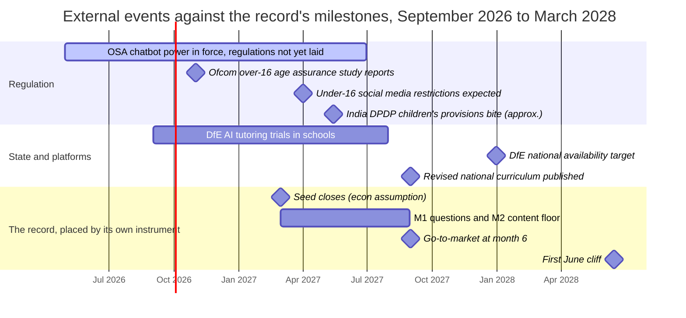
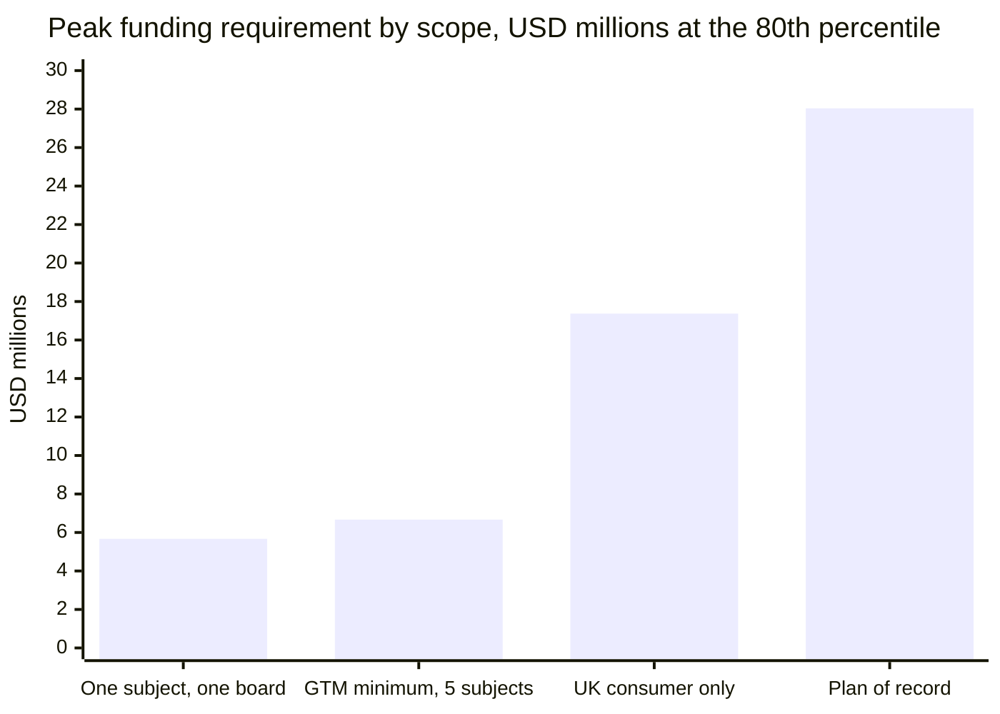
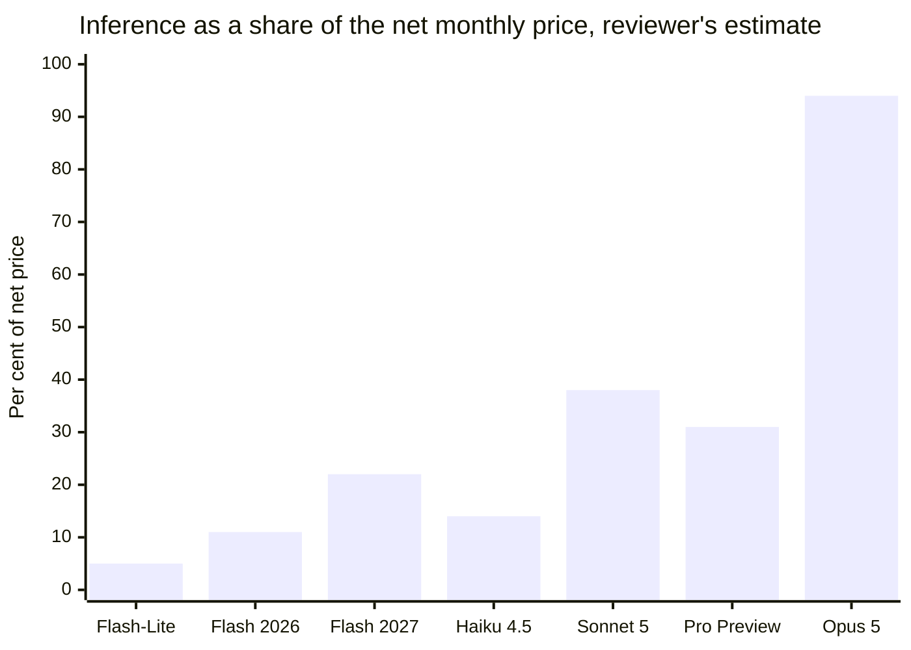
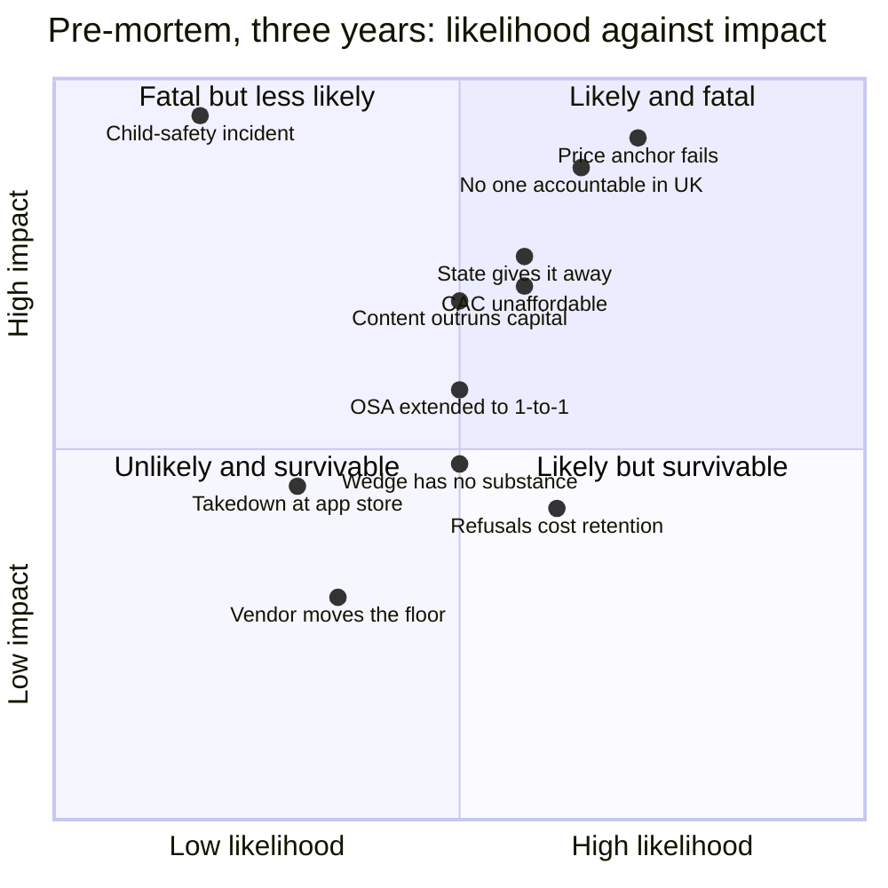

# Venture review: AI.tutor (CINE)

**Date of review:** 18 September 2026. This review is not edited after this date. If the record changes, a dated note is added above this line saying what changed and what remains unanswered; the body stays as written.

**Edition reviewed:** the `main` branch of `sharan50/AI.tutor` at commit `5b58668` (merge of pull request #5, 18 September 2026). Every page in `docs/` carries "Written 14 September 2026"; decisions D38 and D39 in the ledger are dated 17 September 2026; the economics instrument in `econ/` is seed 20260916, run date 16 September 2026. Where this review quotes the record it names the page and section anchor, so the quotation can be checked against that edition and not against whatever the record says later.

**Reviewer:** a Claude Code session, commissioned by the repository owner, working from the repository and from web search. **Access limitation, stated first because it governs the evidence counts at the end:** the session could run web searches but the network policy blocked direct access to every regulator, government, publisher and journal site attempted (the ICO, Ofcom, gov.uk, legislation.gov.uk, AQA, the Sutton Trust, Nature and OpenAI's help centre among them). It could open a small number of vendor and research pages directly (Anthropic's pricing, deprecation and data-retention pages, Google Cloud's pricing and terms, Apple's review guidelines, and Google DeepMind's LearnLM evaluation paper), and its research agents retrieved GitHub mirrors of several statutory texts, which the reviewer then read in part. Everything else, including every regulatory event of 2026 and every fact about a competitor, rests on a search-engine summary or a secondary report. The source list says for each entry exactly what was read.

**Marker key.** *Verified* means the primary source was read in full or in part by the reviewer; where the reading was of a mirror or a saved copy rather than the primary host, the marker says "via mirror". In this review it applies to the record itself, to seven vendor and research pages, and to nine statutory texts read via mirror. *To-verify* means the claim rests on a secondary report or a search summary, and the source list says which. *[EST]* means the reviewer's own estimate or arithmetic, with inputs shown.

---

## 0. The brief, filled in

- **The idea.** The record states it in four sentences and they are quoted here rather than paraphrased, because the review attacks these sentences and not a reading of them (verified, `docs/00-thesis.html#claim`): "CINE sells a warranted answer, not a clever one. A student picks a named educator whose teaching they already recognise, and gets taught in that style from an item bank written to the published specification and checked by a working examiner, where every substantive statement the tutor makes is traceable to a validated item and blocked if it is not. The free tools are better general reasoners than anything we will build and we do not intend to compete with them on that. We compete on being accountable for correctness in a narrow, examined, high-stakes domain, and on letting a fifteen-year-old change how they are taught by naming someone rather than by writing a prompt." It replaces part of a household's spend on a private tutor, and it is sold either direct to parents (Route A, the owner's preference and the record's recommendation) or through schools (Route B).
- **Target markets.** The United Kingdom first, by settled decision D1 (verified, `BUILD_BRIEF.md` §2). The economics instrument, which the site does not link to, models a different plan: United Kingdom consumer launch at month 6, pilots in the United States and India by month 18, then "measured expansion across English-speaking curricula" (verified, `econ/WRITEUP.md` §2). India direct-to-parent is rejected by D1 and is modelled anyway as a scenario. This review treats the United Kingdom as the market and the others as the record's own stated ambition, and reviews the regulatory position of each.
- **What exists today.** Written down only. Sixteen documents, an evidence register of 42 claims, a decision ledger of 39 decisions, two draft contracts unreviewed by any lawyer, a dependency map, a build system, and a 20,000-path Monte Carlo economics instrument. About 51,800 words of prose in the page sources. Thirteen tests specified, none run; twelve counsel questions, none answered; twenty-one assumptions, none verified (verified, `docs/status.html`). No code, no item bank, no pilot, no customer, no employee named. The record says all of this about itself, repeatedly and correctly.
- **The round in question.** Not stated in the record; the roadmap refuses to carry a funding plan (verified, `docs/11-roadmap.html#m6`). The economics instrument sizes it: a seed to month 18 of 10.18 million dollars on the plan of record, 3.27 million on the "go-to-market minimum" (five GCSE subjects, one board, one market), or 1.97 million on one subject and one board, each at the eightieth percentile with six months of buffer (verified, `econ/out/funding.csv`). This review therefore reviews two rounds: the seed the plan of record implies, and the pre-seed that the roadmap's first two milestones would actually consume.
- **Horizon.** Eighteen months, to March 2028.

---

## 1. Executive verdict

**Not yet.** The record is the most honest pre-product design document this reviewer has read, and it describes a content and compliance business that by its own instrument needs about ten million dollars before its first eighteen months are out, with no team named beyond the owner, a launch wedge of a few tens of thousands of households, and a market in which the Department for Education is now funding up to eight suppliers, including the exam board the record aligns to, to put AI tutoring in front of 450,000 of the same pupils by the end of 2027. Fund the questions in milestone one and a timed content pilot with a small cheque, conditional on a United Kingdom-based education co-founder, and do not fund the plan of record.

That verdict can be wrong in two directions, and here is what would prove it wrong.

- **It becomes fund** if, inside two quarters and for less than about £150,000, four things happen: the landing-page test shows parents anchoring on tutoring rather than software (the record's condition C1); a timed validation pilot puts examiner minutes per item under about ten at a rate under about £50 an hour, so a subject bank costs tens of thousands of pounds rather than hundreds; a blind grader can tell two style presets apart above chance (test T-STY-02); and a named person with United Kingdom safeguarding and school experience has joined as a founder, not an adviser. Each of those is a test the record itself specifies.
- **It becomes no** if the Secretary of State uses the new power under the Crime and Policing Act 2026 to bring one-to-one AI chatbots into Online Safety Act scope in a form that treats an AI tutor for children like a companion app, or if the DfE rollout in 2027 is free to every state secondary, or if C1 fails. Any one of those removes the route the record recommends.

Three things weaken the verdict and are stated rather than buried. First, the record's core technical bet, that a retrieval-before-generation gate with a separate verifier can make a correctness promise a general assistant will not make, is a real and buildable difference; nothing in the outside evidence contradicts it. Second, the record's refusal to invent numbers is a virtue this review has had to work around rather than against; a founder who writes "unknown" forty times is easier to trust with money than one who writes a forecast. Third, the persona wedge (D4), which this review attacks hardest, is also the only idea in the record that a competitor cannot copy by spending, because it is a licensing relationship rather than a feature.

---

## 2. The idea, stated at its strongest

Here is the case as its best advocate would make it, before it is attacked.

General-purpose AI tutoring became free in the summer of 2025. Google put a guided-learning mode in Gemini and gave a year of its paid tier to university students in several countries, including, from September 2025, the United Kingdom; OpenAI shipped a study mode; Anthropic shipped a learning mode (to-verify [1], [2], [3], [4]). A venture that pitches "an LLM that teaches Socratically with diagrams" is pitching a feature of three products already on the parent's phone. The record says exactly this about its own 2025 predecessor and does not flinch (verified, `docs/00-thesis.html#dead`).

What a general assistant will not do, and structurally cannot do without abandoning its product strategy, is promise a parent that its answer to a GCSE question is right. Its terms disclaim that. It does not know which board's specification a child sits, it cannot warrant coverage, and when it is wrong it is wrong fluently. A product built to a narrower job can make the opposite promise, provided it is engineered to keep it: every substantive statement cites an item that a working examiner has validated, a verifier checks the statement is entailed by the item before the child sees it, a computer algebra system checks every symbolic step, and the product refuses rather than guesses when it cannot ground an answer. That promise is expensive in precisely the way model capability is not. The item bank and the examiner hours are a rate-limited human process that does not get cheaper when the next model ships. Buy the model; own the bank and the gate.

The market is real and it is concentrated. About three in ten secondary pupils in England and Wales have had private tutoring; the peak is Year 11 at a quarter of pupils; London is at nearly half; prevailing GCSE rates are £25 to £45 an hour (to-verify [5], [6]). A household already paying a tutor is not choosing between this product and a free chatbot. It is choosing between this product and an hour of a human, and at £20 a month the product costs less than one such hour and delivers many hours of contact. School-funded tutoring is contracting at the same time, which argues for going to the household directly.

The wedge is a name. A fifteen-year-old cannot specify a pedagogy but can name a teacher whose videos make sense to them. The product turns that name into a point in a twelve-dimensional space of observable teaching behaviours, licensed from the educator as name and likeness only, with no content ingested, no fine-tuned weights, and a kill switch that disables the preset in fifteen minutes because there is nothing to retrain. The student gets the handle and can then turn it. If the wedge works it is a licensing moat no platform wants to build; if it does not, the product degrades to a correctness-warranted subject tutor with a style control, and the record has already priced that outcome as live.

The plan buys information in ascending order of cost. Two questions that could end the venture, whether parents anchor on tutoring prices and what age assurance costs, are answerable this quarter with a landing page and three phone calls, before a line of code is written. The design is honest about its own limits: it names the June cliff, the safeguarding gap, the uncalibrated grade range, the twelve questions it will not answer without counsel, and the one it has answered ahead of counsel. A record that tells you where it is weak is one you can act on.

That is the strongest version. The rest of this review is the case against it, and the parts of the case that fail.

---

## 3. Technology today: what exists, what is plausible, what is still research

The record's architecture is five planes: content (item bank, retrieval, verifier), style (twelve-parameter object and a card renderer), model (bought, pinned), safety (classifiers bought, policy owned) and identity (age assurance bought) (verified, `docs/06-architecture.html#planes`). Each component is placed below in one of three states: **shipped and dependable** (a business can build on it today), **shipped behind a flag or demonstrated** (exists, but no business should yet depend on its numbers), or **research** (a paper, a benchmark, or nothing).

### Shipped and dependable

- **Frontier models at the price points the design needs.** Read from the vendors' own pages on 18 September 2026: Claude Sonnet 5 at $2 input and $10 output per million tokens, Haiku 4.5 at $1 and $5, Opus 5 at $5 and $25, Fable 5.1 at $10 and $50 (verified [7]); Gemini 3.5 Flash-Lite at $0.30 and $2.50, the Gemini 3.x Flash line at an introductory $0.75 and $3.75 "through December 31, 2026" rising to $1.50 and $7.50 "starting January 1, 2027", Gemini 3.1 Pro Preview at $2 and $12 (verified [8]). OpenAI's page could not be opened; aggregator reports put GPT-5.5 at $5 and $30 and a mini tier at $0.25 and $2 (to-verify [9]). Two details the record should carry: Claude models from 4.7 onward use a tokenizer that "produces approximately 30% more tokens for the same text" (verified [7]), and the Flash introductory price doubles in January 2027.
- **No-training and zero-retention terms exist, with a carve-out the record's marketing line does not survive.** Anthropic: "Retained data is never used for model training without your express permission"; zero data retention is available per organisation on request; but Claude Fable 5.1, Mythos 5.1, Fable 5 and Mythos 5 "require 30-day data retention and are not available under ZDR unless expressly authorized", and under any arrangement "if a chat or session is flagged, Anthropic may retain inputs and outputs for up to 2 years" (verified [10]). Google Cloud: "Google will not use Customer Data to train or fine-tune any AI/ML models without Customer's prior permission or instruction" (verified [11]). OpenAI's terms were not readable (to-verify [12]). The record's D24 gate, "zero retention of prompts and outputs", is satisfiable on the cheaper tiers and not on the top Anthropic tier, and the trust-and-safety retention means "zero retention" is never literally true. The record's marketing line says only "we do not use it to train anyone's AI model", which survives; the DPIA must say the rest.
- **Computer algebra for symbolic checking.** Open-source systems adjudicate the algebra in the launch strand; this is decades old and the record is right to treat check (d) as costing nothing (verified, `docs/06-architecture.html#verifier`). The open question is coverage, which the record marks unknown.
- **Deterministic figure rendering from a specification.** Number lines, axes and plots from data are a template; the record's D28 is sound and its cost is a finite vocabulary, which it states.
- **Certified age assurance as a service.** Ofcom's January 2025 guidance lists methods it considers highly effective (open banking, photo-ID matching, facial age estimation, mobile-network checks, credit-card checks, digital identity, email-based estimation) and excludes self-declaration (to-verify [13]); the ICO's Children's code standard on age-appropriate application lists account-holder confirmation among acceptable methods for lower-risk processing (to-verify [14]). The record's parent-verified model is buildable from any of several vendors. Prices are not published by the market leader; one vendor advertises $0.10 a check, others $1.50 to $6 a session (to-verify [15], [16]).
- **Model version pinning, with a shelf life.** Anthropic gives "at least 60 days' notice before model retirement" and tentative retirement dates "not sooner than" roughly a year after release: Sonnet 5 not before 30 June 2027, Haiku 4.5 not before 15 October 2026; observed deprecation-to-retirement intervals in 2025 and 2026 were two to four months; and the sampling parameters temperature, top_p and top_k return an error on Claude 4.7 and later (verified [17]). Google's platform terms give twelve months' notice for discontinuing a Service "unless Google replaces such discontinued Service or functionality with a materially similar Service", and pre-general-availability models, which includes the current Pro "Preview", are excluded (verified [11]). So D22's pinned version has a floor of about twelve months and then as little as sixty days, the regression battery must re-qualify at least once a year per model, and a pinned prompt configuration can break on a version change. The record does not state this and should.

### Shipped behind a flag, or demonstrated

- **Tutoring modes in general assistants.** Gemini's Guided Learning (August 2025), Anthropic's learning mode (2025) and Microsoft's Study and Learn agent (May 2026) exist; OpenAI's Study Mode existed from July 2025 and was removed in the spring of 2026 (to-verify [1], [4], [18], [19]). None makes a correctness claim and none aligns to an English board. The record's reading is right.
- **Turn-level factual accuracy of a tutoring model, before any verifier.** Google DeepMind's LearnLM evaluation reports, from 39,128 expert ratings over 1,330 model responses, that 96 per cent of a prompt-tuned Gemini 1.0's turns containing factual information and 93 per cent of LearnLM-Tutor's were rated "Fully verified", with 1 to 3 per cent "Incorrect" and 2 to 4 per cent "Partially verified" (verified [20]; a 2024 model, so a floor). That is the base rate a verifier must catch. To reach the record's 99.5 per cent per-turn floor from a 96 per cent base, the verifier has to catch about seven in eight unsupported turns without introducing false blocks that the learner experiences as refusals. Plausible; unmeasured; and the record's ACC-2 should be marked Unknown rather than a chosen floor until M2.
- **Constrained and supervised AI tutors in English schools.** Eedi's constrained tutor in a randomised trial with 2,901 pupils aged 11 to 12 in 20 schools reported two to four months' additional progress, and a separate exploratory trial with Google DeepMind of 165 Year 9 and 10 pupils, with human tutors approving every message, found pupils did at least as well as with human tutors (to-verify [21], [22]). Third Space Learning's Skye runs unsupervised by voice in schools with the company's own outcome claims (to-verify [23]). Medly AI claims 400,000 United Kingdom users and self-reported grade gains, and has published a GCSE benchmark paper this review could not open (to-verify [24], [25]). The category the record wants to enter is demonstrated in England by three companies with pupils; the correctness warranty is not demonstrated by any of them.
- **Grounded generation with a verifier.** Faithfulness evaluators for retrieval-augmented generation report agreement with human judges of about 0.95 on faithfulness, and atomic-fact scorers report automated error under 2 per cent, on encyclopaedic text (to-verify [26], [27]); entailment-based detectors are reported to struggle on unverifiable claims (to-verify [28]). Nothing found reports an end-to-end per-turn groundedness at or near 99.5 per cent for a generator-plus-verifier pipeline in mathematics tutoring. The record's design is the right shape; its number is a target, not a capability.
- **Guardrailed tutoring protects learning; unguarded tutoring harms it.** Bastani and colleagues' randomised trial with about a thousand Turkish secondary pupils: unguarded GPT-4 raised practice scores by 48 per cent and lowered unaided exam scores by 17 per cent; a hint-only tutor raised practice by 127 per cent with no exam harm and no exam gain (to-verify [29]). This is the strongest evidence for the record's D15 unaided check and its refusal to give answers, and the record does not cite it.

### Research

- **Following twelve pedagogical constraints at once, over a 20 to 30 turn session.** Benchmarks of multi-constraint instruction following exist and report degradation as constraints accumulate, with one multi-turn study reporting the steepest drops "at around turn 4 and 11" (to-verify [30]); no paper found tests twelve simultaneous pedagogical constraints. Google's own LearnLM finding is that prompt-tuning a base model was weaker than training on pedagogy data: "LearnLM-Tutor is consistently preferred over a prompt tuned Gemini by educators and learners on a number of pedagogical dimensions", with no difference on accuracy (verified [20]). The record's D7 and D8 (prompting only, no fine-tuning, so the kill switch is real) therefore cap style fidelity at the weaker of the two known methods, which the record admits (verified, `docs/06-architecture.html#harder`). T-STY-01 and T-STY-02 are the tests; they have not been run by anyone.
- **Blind-discriminable pedagogical style without tone.** The record excludes warmth and register from the twelve dimensions on principle (D17) and predicts this makes presets harder to tell apart. No literature was found either way. This is research the record will do itself at M3.
- **Educator style as a stable point rather than a cloud** (OA-11). Unstudied. The record's rating protocol is the study.
- **A calibrated grade range from unaided-check performance without a cohort that has sat the examination.** Not a capability anyone has; the record says so and ships the band uncalibrated for a year (verified, `docs/05-safety-privacy-regulatory.html#graderange`). This reviewer would not ship it to parents.
- **Voice personas of named real people.** Off the record's launch path (D9). The two largest voice vendors are reported to prohibit cloning a real person's voice without consent and, at one of them, to block "prominent public figures" outright (to-verify [31]). The Schedule 3 voice limb may be unbuildable on those vendors for exactly the creators the record wants.

**Summary of section 3.** Everything the record needs to build the content plane exists and is priced. The verifier's target number is a hypothesis. The style engine rests on the weaker of two known methods and on tests nobody has run. Age assurance is a purchase. The vendor dependency is real and has a twelve-month clock on it that the record does not mention. Nothing here is a reason not to build; three things here are reasons not to believe the floors until M2.

---

## 4. Technologies on the horizon, and how each threatens the idea

The most common way an AI venture dies is that the platform ships the feature. For this idea there are three platforms that can do it: the frontier labs, the exam boards, and the state. Each is taken in turn, with the mechanism, who ships it, and what it would take for the record's differentiation to be commoditised by it. The horizon is eighteen months, to March 2028.

### The state ships a free tutor to the pupils the record wants most

- **Mechanism.** The Department for Education is funding up to eight suppliers, at £300,000 each, to design and test AI tutoring tools with teachers, with trials in secondary schools from autumn 2026, national availability targeted for the end of 2027, and a stated reach of up to 450,000 disadvantaged pupils in Years 9 to 11 (to-verify [32], [33], [34]). The EEF is named as evidence partner. Named winners in press reports are Pearson (in partnership with Anthropic), Eedi, ElevenLabs, Learn Anything, Medly AI and Zero Gravity, from 53 applications; Google was removed in July 2026 and replaced by PA Consulting (to-verify [35], [36]).
- **What it commoditises.** Not the correctness gate, which the DfE's own notice says the market lacks ("limited in quantity, scope and evidence base"). It commoditises the school channel and the low-income parent. A state tutor free to a pupil on free school meals removes a fifth of the record's wedge (the 23 per cent of worst-off households who tutor) and every school's reason to buy a second one. It also sets a de facto standard: the DfE says the pioneers will "research and co-design a high-quality, all-encompassing standard for AI tutoring tools" (to-verify [34]). A product outside that standard will be asked why.
- **Timing against the record.** Trials begin the month the record was written. National rollout lands nine months before this review's horizon ends. Route B, as the record describes it, is competing with a free product co-designed with teachers and funded by the buyer's own department.

### The exam board ships its own tutor, with a frontier lab

- **Mechanism.** Pearson, which owns Edexcel, is one of the DfE pioneers and is reported to be building with Anthropic (to-verify [35]). Pearson holds the largest share of GCSE mathematics (to-verify [37]), owns the specification, the past papers, the mark schemes and the examiner relationships, and is the only party that can ship "real Edexcel questions" and "Edexcel mark schemes" without a licence. The record's clean room exists because boards forbid AI use of their material; the board itself is under no such constraint.
- **What it commoditises.** The correctness warranty, which is the record's "only durable technical basis" (verified, `docs/00-thesis.html#pay`). A board-authored tutor can warrant alignment to its own specification in a way no third party can, and can say so in the words the record's naming convention forbids everyone else from using. It does not commoditise the persona wedge, and it is unlikely to want to.
- **What it would take.** Nothing the board does not already have. The gating question is whether Pearson chooses to sell it to parents or only to give it to schools through the DfE programme. AQA's published policy forbids AI use of its material by third parties (to-verify [38]); it says nothing about AQA's own use.

### The frontier labs add the thing the record says they will not

- **Mechanism.** Grounded generation with citations and a verifier is not a research problem; it is a product decision. Google's Guided Learning is built on LearnLM, which Google says is trained on learning science (to-verify [1]); Anthropic's Claude for Teachers (July 2026, United States) claims "a direct connection to academic standards in all 50 states" (to-verify [39]); Microsoft's Study and Learn agent (May 2026) is a first-party tutor inside Copilot for students aged 13 and over (to-verify [18]). None of these aligns to a United Kingdom board or makes a correctness warranty. The standards-alignment claim in the United States is the template for a board-alignment claim in England, and the DfE and Oak are building "a machine-readable digital national curriculum" that would make such alignment a download rather than a project (to-verify [40]).
- **What it commoditises.** Specification knowledge, which the record already concedes is not the asset (verified, `docs/00-thesis.html#hold`). A lab that ingests the digital national curriculum and offers "GCSE mode" removes the record's second reason a parent pays. It does not remove the examiner-validated bank or the refusal behaviour, because a general assistant that refuses is a worse general assistant.
- **What it would take.** A curriculum feed (being built by the state), a product manager who cares about England (the DfE programme gives them a reason), and no correctness warranty, because the labs' terms will continue to disclaim one. The record's counter-signal is real: OpenAI removed Study Mode from ChatGPT without announcement in the spring of 2026 (to-verify [19]), which suggests at least one lab has decided pedagogy is not its product.

### The incumbents add a warranted layer

- **Mechanism.** Eedi has run a constrained AI tutor in twenty United Kingdom schools in a randomised trial and a second trial with Google DeepMind across 1,525 pupils (to-verify [22], [21]); Medly AI, launched February 2025, claims over 400,000 United Kingdom users, raised an $8m seed in August 2026 and is a DfE pioneer (to-verify [24]); Third Space Learning's Skye is a voice tutor in schools with its own impact evaluation (to-verify [23]); Seneca, owned by GoStudent, sells 1,500 board-specific courses with an AI tutor called Amelia (to-verify [41]); Tassomai sells an AI tutor "Mai" to families at £3.99 to £8.99 a month (to-verify [42]).
- **What it commoditises.** The price. Four United Kingdom consumer AI study products are priced between £4 and £12 a month (to-verify [42], [43], [44]). That is the software anchor the record fears, already set by companies with GCSE users. Medly AI's self-reported grade gains are marketing, but they are marketing the record cannot yet match with anything, because it has not run a session.
- **What it would take.** For Medly or Eedi to add per-item examiner validation and a refusal gate: a content operation, which they can fund, and a willingness to refuse, which is a product decision. This is the competitor the record should model, not Google.

### Capabilities that erode the architecture's margins

- **Long context and native citation.** Every design choice in the record's turn pipeline assumes retrieval before generation because "an architecture where the model calls a search tool cannot tell, afterwards, whether a claim came from a retrieved document or from the model's own weights" (verified, `docs/06-architecture.html#turn`). Vendors now ship citation and grounding features natively; if a vendor's own grounding metadata becomes reliable enough to audit, the record's composer and verifier become a thinner layer, and the moat narrows to the bank and the examiners. Eighteen months is enough for that to happen. Threat to the architecture, not to the thesis.
- **Voice.** Skye is voice; ElevenLabs is a DfE pioneer; the record's D9 keeps voice off the launch path for rights and regulatory reasons (verified, `BUILD_BRIEF.md` §2). A text-only tutor against voice competitors is a product decision the record has made deliberately and will be asked about by every fifteen-year-old.
- **Persona products.** Two precedents exist for the record's wedge: Goblins, a United States maths app that clones a pupil's own classroom teacher's likeness and voice with the teacher's consent, and Teacher AI, which offers "AI clones of popular YouTube language teachers" under partnerships (to-verify [45], [46]). The wedge is not original, which is good news for its plausibility and bad news for its defensibility. The commoditisation route is a creator platform (YouTube, or a lab) offering every educator a licensed clone; the record's defence is that it does not need the clone, only the name and twelve numbers.
- **Cheaper inference.** The instrument assumes 8 to 55 per cent annual decline in unit inference price (verified, `econ/out/drivers.csv`). This helps the record and helps every competitor equally.

*Figure 1. Takeaway: on the record's own calendar the product launches in the same term the DfE trials end and three months before the state's national rollout target. For a reader who cannot see it: a timeline from September 2026 to June 2028 with regulatory milestones (chatbot power, age assurance study, under-16 restrictions, India), state milestones (DfE trials, rollout, new curriculum) and the record's undated milestones placed at the economics instrument's assumed dates (seed March 2027, launch September 2027, first June cliff 2028). Sources: to-verify items in section 5 for the external dates; `econ/out/constants.csv` for the record's placement (verified). The record itself carries no dates by decision D32.*

---

## 5. Regulatory position, by market

The record's market is the United Kingdom. Its operating company is Indian. Its economics instrument opens the United States and India by month 18 and "the rest of the English-speaking world" after. Each is taken in turn. For each rule: the regulator, the date it lands, and whether compliance is a build, a licence, a contract or a refusal to operate.

### United Kingdom

| Rule | Regulator | Lands | What compliance is | The record's position, and the gap |
|---|---|---|---|---|
| UK GDPR and the Data Protection Act 2018; the Children's code (Age Appropriate Design Code), fifteen standards, in force since September 2020 | ICO | In force. The Data (Use and Access) Act 2025 (Royal Assent 19 June 2025) replaced Article 22 with Articles 22A to 22D and inserted Article 25(1A), "children's higher protection matters", both commenced 5 February 2026 (verified via mirror [47], [48]); it also establishes the Information Commission as a body corporate | Build (DPIA, privacy by default, lawful basis, the new Article 22C safeguards) plus contract (vendor zero-retention, processor terms) | The record maps all fifteen standards and admits the enumeration is from memory (verified, `docs/05-safety-privacy-regulatory.html#code`); the fifteen names match the ICO's list (to-verify [49]). The DPIA is unwritten. Lawful basis for a child's data under a parent's contract is open (OI-10). The record's grade-range analysis is written to the old Article 22; the conclusion survives under Article 22A ("a decision is a significant decision ... if it produces a legal effect ... or has a similarly significant effect") but the DPIA must be written to the new articles and to Article 25(1A) |
| Age assurance for services likely to be accessed by children | ICO, with Ofcom | Enforcement live: Reddit fined £14.47m on 24 February 2026 for having no robust age assurance and therefore no lawful basis for processing under-13s' data, and for having no DPIA before January 2025; MediaLab (Imgur) fined £247,590 in February 2026, reported as the first Children's code fine; TikTok £12.7m in April 2023 (to-verify [50], [51]). ICO open letter of 12 March 2026 to social media and video-sharing platforms: self-declaration "as currently deployed ... should not continue to be relied upon"; joint ICO and Ofcom statement of 25 March 2026: "self-declaration alone is not an effective means to determine the age or age range of users" (to-verify [52], [53]) | Build plus contract with a certified provider | The record verifies the adult and treats every learner as a child, which is stronger than the letter demands and better than most. Cost per check is likely small (section 7). Two register errors: EV-26 gives "profiling children without a lawful basis" as a Reddit ground, which no source seen supports, and cites a "Snap £1.95m" fine that this review could not find anywhere; the ICO's Snap action in October 2023 was a preliminary enforcement notice over its "My AI" chatbot (to-verify [54]) |
| ICO scrutiny of edtech specifically | ICO | The ICO's "Edtech examined" statement of 25 June 2026 reports consensual audits of 28 edtech providers in 2024 and 2025, 596 recommendations, continuing work with 12 providers, and discussions with the DfE on "a new edtech code" (to-verify [55]) | Build, and a code to come | The record's EV-28 says the ICO "has stated it will audit edtech providers". It already has, and a sector code is being discussed. Both should be in 05 |
| UK GDPR Article 27 representative for a non-UK controller; Article 3(2); international transfers to India (IDTA or UK Addendum plus a transfer risk assessment) | ICO | In force (Article 27(1): a controller not established in the United Kingdom "shall designate in writing a representative in the United Kingdom", verified via mirror [56]) | Contract (representative; transfer instrument) plus build (transfer risk assessment) | Named as gaps, unresolved (verified, `docs/05-safety-privacy-regulatory.html#gaps`). Cheap; embarrassing if missed |
| Online Safety Act 2023, Part 3 user-to-user and search duties; Protection of Children Codes in force July 2025; maximum penalty "whichever is the greater of (a) £18 million, and (b) 10% of the person's qualifying worldwide revenue" (Schedule 13, verified via mirror [57]); service and access restriction orders on application to the court (sections 144 to 147) | Ofcom | In force. Ofcom's guide of 18 December 2025 says a chatbot is not regulated if it lets a user interact only with the chatbot, does not search multiple websites and cannot generate pornographic content (to-verify [58]). Enforcement to date: Ofcom reports "more than £6 million" in online safety fines, including £950,000 on an overseas suicide forum in May 2026, after which Ofcom said in July 2026 it had "no further legal routes available" because the site geoblocked United Kingdom users (to-verify [59]) | Today: a scoping decision and a change-control gate, which the record has. Tomorrow: possibly a build | The record's position (out of scope at launch, eight internal triggers) matches Ofcom's published reading, which it does not cite. Its EV-33 ("penalties totalling £6.1m on nine companies" between April 2025 and June 2026) could not be found in any source and should be replaced with what Ofcom has published; the £950,000 case ended with Ofcom conceding it could not reach a geoblocked overseas provider, which cuts against the record's own point that the Act "does not care where you are established" |
| **Power to bring AI chatbot services into the Online Safety Act by regulations**: Crime and Policing Act 2026, Royal Assent 29 April 2026, following the Prime Minister's announcement of 16 February 2026 that one-to-one interactions with AI would be brought within illegal-content controls; the Act also creates an offence of making available a chatbot that produces proscribed content | Secretary of State (DSIT), then Ofcom | Power in force; regulations not yet laid as far as this review could find; a progress statement was due by 29 July 2026 and this review could not find it (to-verify [60], [61], [62]) | Unknown until regulations are laid; at minimum illegal-content duties, risk assessments and possibly age assurance on the service itself | **Absent from the record.** This is the external trigger that reverses the record's scoping decision and it is not on the trigger list. Add it and re-run the analysis when regulations are laid |
| Under-16 social media restrictions: Children's Wellbeing and Schools Act 2026 section 70 inserts section 214A into the Online Safety Act requiring regulations; the government announced a ban on 15 June 2026 after a consultation with 116,211 responses; expected in force spring 2027; Ofcom rapid study on effective over-16 age assurance reporting by end October 2026 | DSIT, Ofcom | Regulations expected before end 2026, in force spring 2027 (to-verify [63], [64], [65]) | Likely no direct duty on a one-to-one tutor; indirect: the age assurance market, parents' expectations, and the definition of "social media functionality" the regulations adopt | Absent from the record. The record's T3 to T7 triggers (group sessions, feeds, messaging) are exactly the functionalities the ban targets, which strengthens the record's case for never shipping them |
| DfE "Generative AI: product safety expectations" (22 January 2025) and the DfE policy paper "Generative artificial intelligence (AI) in education" (updated 12 August 2025): "Pupils should only be using generative AI in education settings with appropriate safeguards in place, such as close supervision and the use of tools with safety and filtering and monitoring features" (to-verify [66], [67]); Keeping Children Safe in Education 2025 (1 September 2025) and 2026 (1 September 2026) for schools' filtering, monitoring and supplier due diligence (to-verify [68]) | DfE (non-statutory for suppliers; statutory guidance for schools) | In force | Build: filtering, monitoring, age-appropriate design, data handling a school can evidence; and the DfE pioneer standard that will follow | The record admits neither document has been read against the design (OA-20). For Route B this is the first question a school asks; for Route A it is the standard a parent's school will cite |
| Consumer law: Consumer Contracts Regulations 2013 (14-day cancellation); Consumer Rights Act 2015 (digital content); Digital Markets, Competition and Consumers Act 2024, Part 4 Chapter 1 unfair commercial practices in force 6 April 2025 (verified via mirror [69]); the subscription-contracts regime (reminders, cooling-off on renewal, easy exit) not yet commenced, government target spring 2027 (to-verify [70]) | CMA, with direct enforcement powers since April 2025 | Partly in force; subscription regime pending, inside the horizon | Build (billing flows, reminders, exit) plus contract (terms) | Named in one row of the Route A compliance table and nowhere else (verified, `docs/07-route-a-direct-to-parents.html#compliance`). The instrument says plainly there is "no United Kingdom consumer subscription regime in the model" (verified, `econ/LIMITS.md`). A cycle plan billed monthly with a June exit is exactly the contract the regime targets |
| Advertising: CAP Code rules 3.1 (misleading), 3.3 (omission) and 3.7 (substantiation: marketers "must hold documentary evidence to prove claims that consumers are likely to regard as objective"), Section 5 on children, and CAP guidance on qualification claims (to-verify [71]) | ASA | In force | Build (copy discipline) | Open item OI-12, "not analysed"; the record's naming convention is trade-mark-only. Any claim about grade improvement, of the kind a competitor already makes, needs substantiation the record does not have |
| Trade marks: Trade Marks Act 1994 section 11(2)(b) (indications of "kind, quality ... intended purpose") and 11(2)(c) (use "for the purpose of identifying or referring to goods or services as those of the proprietor ... in particular where that use is necessary to indicate the intended purpose"), "provided the use is in accordance with honest practices" (verified via mirror [72]); passing off | Courts, and in practice the app stores | In force | Build (wording) plus, for creators, contract | The record's convention is sensible and its rollback plan realistic; the section's two limbs are the ones the record correctly says counsel must choose between. Pearson runs an open endorsement scheme for publishers (to-verify [73]); the record should ask whether an unendorsed product may say "written to the Pearson Edexcel specification" and, separately, whether to apply for endorsement, which would change the war-game entirely |
| VAT: standard rate on a business-to-consumer digital service; the education exemption for private tuition applies only to a sole trader or partner teaching in a personal capacity, so "any tuition provided through a limited company will always be standard rated" (to-verify [74]) | HMRC | In force | Build (pricing display, VAT registration) | Not on the site; correct in the instrument (verified, `econ/out/constants.csv`). See section 7 |
| Examinations: Ofqual's decisions on formulae sheets for 2025 to 2027 and from 2028 for the life of the current qualifications; reformed GCSEs first taught 2029 and 2030, first examined 2031 and 2032, after a revised national curriculum published 2027 for first teaching 2028 (to-verify [75], [76]) | Ofqual, DfE | Dated as stated | Build (content revalidation) | Not a rule the record breaks; a shelf life it does not state. Content written to the current mathematics specification is examinable through at least 2030, longer than this review expected, and every item then needs rewriting to a specification not yet published |

Two summary judgements. First, the record's United Kingdom data-protection posture is above the standard of the sector, and its Online Safety Act posture was correct on the day it was written and is now five months behind the law. Second, the record has analysed the regulators that fine and not the ones that buy or that write codes: the DfE's product-safety expectations and its pioneer standard will decide Route B, the ICO's coming edtech code will bind both routes, and the CMA's subscription regime will shape Route A's billing, and none of the three is in the record.

### India (the operating entity; and Route C if ever revisited)

| Rule | Regulator | Lands | What compliance is | Position |
|---|---|---|---|---|
| Digital Personal Data Protection Act 2023, section 9(3): "A Data Fiduciary shall not undertake tracking or behavioural monitoring of children or targeted advertising directed at children"; DPDP Rules 2025, G.S.R. 846(E), 13 November 2025; Rule 10 verifiable parental consent; Rules 3, 5 to 16, 22 and 23 "shall come into force eighteen months after the date of publication", so 13 May 2027; Fourth Schedule Part A exempts "an educational institution" for tracking "for the educational activities of such institution" (verified via mirror [77]) | Data Protection Board of India | Phased, with the children's provisions inside this review's horizon | Refusal to operate direct-to-child (the record's D1), unless the educational-institution exemption reaches a commercial edtech provider, which nothing in the text says it does | Correct. The instrument prices the direct-to-parent India scenario as a loss (verified, `econ/WRITEUP.md` §12). An Indian entity processing United Kingdom children's data is nonetheless a data fiduciary under Indian law for that data too; the record does not analyse the overlap |
| IT (Intermediary Guidelines and Digital Media Ethics Code) Amendment Rules 2026, G.S.R. 120(E), 10 February 2026: "synthetically generated information" must be "prominently labelled ... and embedded with a permanent metadata or other appropriate technical provenance mechanisms"; takedown windows cut to three hours and, for intimate imagery, two hours; and a proviso excluding "the routine or good-faith creation ... of ... educational or training materials" from the definition (verified via mirror [78]) | MeitY | In force (commencement 20 February 2026, to-verify [79]) | Build (labelling, metadata), if the rules apply | The record treats the labelling duty as engaged (verified, `docs/04-rights-dossier.html#india`). The proviso for educational materials may take tutor output outside the definition altogether, and whether a tutor is an "intermediary" is not analysed. Counsel should say which; the record should not assume the duty bites, nor that it does not |
| Personality rights: Anil Kapoor (2023), Jackie Shroff (2024), Arijit Singh (2024, voice), Hrithik Roshan v Ashok Kumar, CS(COMM) 1107/2025, Delhi High Court, order of 15 October 2025; Sonakshi Sinha v Character Technologies Inc, CS(COMM) 275/2026, Delhi High Court, order of 20 March 2026, ex parte injunction against AI chatbot platforms with takedown within 36 hours (to-verify [80]) | Delhi and Bombay High Courts | Live | Contract (the licence) plus build (kill switch) | The record's analysis is the best part of the rights dossier: the Indian base is a forum for a claimant, not a shield. Its "72-hour takedowns and domain suspensions" for the Roshan order could not be confirmed |
| Section 44A Code of Civil Procedure 1908: a decree of a superior court of a reciprocating territory "may be executed in India as if it had been passed by the District Court" (verified via mirror [81]); the United Kingdom notified in 1953; TransAsia Private Capital v Gaurav Dhawan, Delhi High Court, 6 April 2023, enforcing an ex parte English Commercial Court judgment (to-verify [82]) | Indian courts | Live | None; it is why D13 dropped the offshore theory | Correct reasoning. The register's EV-36 should name the case |
| GST on online services (OIDAR) at 18 per cent, with foreign business-to-consumer suppliers required to register from October 2023 | CBIC | In force (to-verify [83]) | Build | Only relevant to Route C; in the instrument |

### United States (the instrument's second market; not in the record's plan)

| Rule | Regulator | Lands | What compliance is | Position |
|---|---|---|---|---|
| COPPA, as amended by the FTC's 2025 final rule: verifiable parental consent for under-13s, separate consent for third-party disclosure, data retention limits; compliance dates in 2025 and 2026 | FTC | In force, with the amended rule's compliance deadline inside the horizon (to-verify; this review could not confirm dates [84]) | Build plus contract | Absent from the record. The record's design (verified adult enrols the child, no under-13 self-declaration) is close to COPPA-shaped by accident |
| FERPA and state student-privacy laws for the school channel | ED, state AGs | In force | Contract (school agreements) | Absent |
| State AI companion-chatbot laws: Idaho, Oregon and Washington laws in force by July 2026 requiring chatbots not to claim sentience or initiate sexual conversations with minors; California SB 243 on companion chatbots (to-verify [85]); the FTC's September 2025 Section 6(b) inquiry into seven companion-chatbot operators (to-verify [86]) | State AGs, FTC | 2026 | Build (disclosures, protocols) | The record's anti-companionship design (verified, `docs/05-safety-privacy-regulatory.html#content`) is aligned in spirit; the definitions of "companion" in these laws would need reading against a persona-bearing tutor, which is closer to the definition than the record would like |
| Right of publicity, state by state, for the creator licence | State courts | Live | Contract (a United States-law limb) | The record assumes most creators are United States-resident (OA-9) and has not drafted the limb |

### Ireland and the rest of the English-speaking world (the instrument's later markets)

Ireland is in the European Union, so the EU AI Act applies: general-purpose model obligations from August 2025, and Annex III high-risk obligations, which name AI systems used to evaluate learning outcomes and to determine access to education, from August 2026 with a further transition to 2027 for some categories (to-verify [87]). A provisional grade range shown to a parent is arguably an evaluation of learning outcomes. Compliance would be a build (conformity assessment, logging, human oversight) and, for a company of this size, a reason not to enter. Australia's under-16 social media restrictions (in force December 2025) and its own curriculum structure are the instrument's own warning: "the foreign markets are the United Kingdom calendar copied" (verified, `econ/LIMITS.md`). None of this is in the record, and none of it should be until the United Kingdom works.

---

## 6. Market, customer and competition

### The wedge, sized from the bottom up

The record sizes nothing, on principle, and quotes an "earlier Sutton Trust estimate" of a market "up to £2bn" (verified, `evidence/sources.html` EV-19; the wording could not be matched to a Sutton Trust page and is to-verify [5]). A market report is not a wedge. Here is the wedge the launch scope actually addresses.

| Step | Figure | Basis |
|---|---|---|
| Sixteen-year-olds in England, 2025 | 709,586 | to-verify: ONS figure quoted in Ofqual's provisional entries release for summer 2026 [88] |
| of whom ever privately tutored, Year 11 | 25% | to-verify: Sutton Trust, Private Tutoring 2026, Ipsos sample aged 11 to 17 [5] |
| of whom sitting Pearson Edexcel mathematics | about 60% | to-verify: Pearson "has the largest share in mathematics" per Ofqual's market report; a 2026 teacher survey put Edexcel at 67% of responses; the exact split is in a table this review could not open [37], [89] |
| of whom entered at Higher tier | about 55% | [EST] reviewer's assumption; not found |
| of whom whose tutoring includes mathematics | about 60% | [EST] reviewer's assumption; not found |
| **Households in the launch wedge** | **about 35,000** | [EST] product of the above |

At the instrument's modal tutoring-anchored price of £22 a month gross and six retained months, that wedge is worth about £4.6m of gross revenue a cycle at 100 per cent share, £3.9m net of VAT [EST]. At a 5 per cent share, which would be a strong first year for a consumer product against free tools, it is about £190,000 net [EST]. Widen the scope to every board, both tiers and Year 10, mathematics only, and the pool of households currently paying for tutoring that includes mathematics is about 145,000 [EST: (709,586 × 0.25 + 709,586 × 0.10) × 0.6]. That is the honest ceiling on the maths-only consumer business, and it is why the instrument's go-to-market minimum carries five subjects, not one.

The record's "Year 11 is the peak" reading is right and cuts both ways. Year 11 is where the money is and where the customer leaves in June. The 16-year-old cohort is rising slightly to 2026 and the secondary population then falls by about 4 per cent from 2026-27 (to-verify [90]), so the wedge shrinks over the horizon rather than growing.

### The customer

Two customers who want different things: the parent who pays and the child who uses. The record handles this better than most consumer edtech, with objective-level parent reporting rather than transcripts (D16) and a refusal to use engagement mechanics on the child (D25). What the record does not do is describe the parent. The Sutton Trust data says tutoring is most common in London, in urban areas, and among Black and Asian pupils, and that the worst-off households tutor at 23 per cent against 30 per cent for the best-off (to-verify [5]). The record correctly refuses to target on protected characteristics (D31). It should still know that a fifth of its first thousand customers will be paying for tutoring from a household in the bottom income quintile, for whom £22 a month is a real decision and for whom a free DfE tutor arriving in 2027 is a real alternative.

### Competition, in the order it matters

1. **The state.** The Department for Education's AI Tutoring Tools Pioneer Programme, announced in the spring of 2026 (one mirror dates the press release 17 April 2026; it was reported again in June): up to eight contracts sharing £2.88m to design and test tools with teachers, trials in schools from autumn 2026, and a stated aim of tools "available nationally" by the end of 2027 for up to 450,000 disadvantaged pupils in Years 9 to 11 (to-verify [32], [33], [34]). The winners named in press reports are Pearson (in partnership with Anthropic), Eedi, ElevenLabs, Learn Anything, Medly AI and Zero Gravity, one report adding Flint, with PA Consulting replacing Google in July 2026 (to-verify [35], [36]). Two of those names matter to the record in particular: Pearson is the exam board the launch aligns to, and Eedi has already published a supervised RCT of an AI tutor with 165 Year 9 and 10 pupils in five English schools (to-verify [22]). The DfE's own contract notice says the tools currently on the market "are limited in quantity, scope and evidence base", which is both an opening and a warning (to-verify [34]). The record does not mention the programme. It was announced three months before the record was written.
2. **The platforms.** Gemini's Guided Learning (August 2025) and free Google AI Pro for university students including in the United Kingdom from September 2025; Anthropic's learning mode; and, in the other direction, OpenAI quietly removing Study Mode from ChatGPT in the spring of 2026 (to-verify [1], [2], [19]). Khanmigo remains unavailable to United Kingdom consumers, at $4 a month for United States residents only (to-verify [44]). The record's list of "three free toggles" is now two, and its claim that the free tier was given away in five countries omits the one that matters. Neither correction changes the thesis; both show the register was not checked at the date it claims.
3. **The incumbents.** Sparx Learning says its products reach over half of United Kingdom schools, priced per school on request (to-verify [91]); Third Space Learning's Skye is a voice AI maths tutor sold to secondary schools from £5,000 a year unlimited, with the company reporting 4,100 schools across its services and a self-reported exit-ticket accuracy of 70 per cent across 200,000 Skye sessions against 66 per cent for its human tutors (to-verify [23]); human marketplaces MyTutor (from £26 an hour at GCSE, acquired by IXL Learning in May 2025) and Tutorful (GCSE average £35.86) are the price anchor the record depends on (to-verify [92], [6], [93]). Three consumer products already sell AI study help to the record's customer at software prices: Medly AI, launched February 2025, claiming over 400,000 United Kingdom users and self-reported GCSE grade gains, with an $8m seed in August 2026 and a DfE pioneer contract; Tassomai's "Mai" at £3.99 to £8.99 a month; Save My Exams at about £12 a month (to-verify [24], [42], [43]). The counter-evidence for the record's tutoring anchor is Atom Learning, an adaptive 11-plus preparation product for parents with reported revenue of £13.2m in 2024 (to-verify [94]): when the examination is high-stakes and the alternative is a tutor, parents have paid software companies tutoring-shaped money before. Revision publishers and sites (CGP, Save My Exams, Physics and Maths Tutor, Seneca) sell board-specific material without board licences, which is the record's untested assumption OA-5; this review could not test it either.
4. **The comparable that died, and precisely why.** Chegg. On 2 May 2023 its shares fell 48 per cent in a day after it said ChatGPT was affecting new-customer growth; in February 2025 it sued Google over AI Overviews, reporting non-subscriber traffic down 49 per cent; in October 2025 a year-long strategic review ended with no buyer and a 45 per cent layoff; revenue fell from about $105m in the second quarter of 2025 to $51.8m in the second quarter of 2026 (to-verify [95], [96], [97], [98]). The mechanism is exact and it is the mechanism the record fears: Chegg sold answers to homework questions, a platform shipped a free general answerer, and then the platform's search product answered the question before the student reached Chegg's page. Chegg's answers were human-written and expert-checked, which is the closest existing analogue to an examiner-validated bank, and that did not save it, because the customer's job was "get me through tonight's problem set" and a free fluent answer does that job. The record's defence is that its customer's job is "pass an examination in June" and that a warranted answer is worth paying for in that job. That is a different job and the record is right to say so; whether the parent can tell the difference is untested (verified, `docs/00-thesis.html#pay`).

Two more comparables carry proportion. Byju's, the largest direct-to-parent edtech ever funded, went from about $22bn to a founder-stated valuation of zero in two years through debt, governance failure and acquisition spend, not through product failure (to-verify [99]); the lesson is about capital intensity in consumer edtech, which the instrument prices. First Tutors, a United Kingdom tutoring marketplace of twenty years' standing, closed in May 2026 under its United States parent Nerdy, which was losing about $4m a quarter (to-verify [100]); the lesson is that the human-tutoring market the record substitutes for is itself being squeezed at the marketplace layer.

### The record's claims against the outside evidence

| What the record claims (verified, with anchor) | What the outside evidence says (to-verify unless marked) | What to do about the gap |
|---|---|---|
| "OpenAI launched Study Mode ... Claude has an equivalent Learning Mode. All are free toggles." (`00-thesis#dead`, EV-01 to 03, marked Verified September 2026) | Study Mode was removed from ChatGPT without announcement in about April 2026; Gemini and Claude retain theirs [19] | Correct the claim; it strengthens, not weakens, the thesis (the largest platform walked away from pedagogy) |
| Google gave 12-month AI Pro to students "in the US, Japan, Indonesia, Korea and Brazil" (EV-05) | United Kingdom university students (18+) were offered the same from 4 September 2025 [2] | Add the United Kingdom; note it is university students, not GCSE pupils |
| ASSISTments "0.18 to 0.29 SD across two large RCTs" (EV-09, Verified) | 0.18 overall in the Maine trial with 0.29 for a low-prior-attainment subgroup; the replication found 0.10 measured a year late [101] | Restate as 0.10 to 0.18 overall; remove the Verified marker until the primary reports are read |
| MATHia "0.21 to 0.38 SD across more than 18,000 students in 147 schools" (EV-10, Verified) | 0.21 is RAND's 147-school trial, high schools, year two only; 0.38 is a separate ETS end-of-course study [102] | Separate the two studies; state the year-one null and the middle-school null |
| Kestin et al. "median learning gains more than double" (EV-08) | 194 Harvard undergraduates, single sessions, GPT-4 tutor preloaded with correct solutions [103] | Keep, and add the design detail, because preloaded correct solutions is exactly the record's architecture |
| "a one-to-one tutor with no sharing between users sits outside the OSA user-to-user duties" (OA-6, Assumed) | Ofcom's December 2025 guide says a chatbot that only lets the user talk to the chatbot, does not search multiple sites and cannot generate pornography is not regulated; the Crime and Policing Act 2026 then gave the Secretary of State power to bring AI chatbot services into scope by regulations [58], [60] | Cite Ofcom for today's position; add the 2026 power as the trigger that reverses it; re-run the scoping decision when regulations are laid |
| "Relative board share of GCSE Mathematics entries ... has not been checked" (`03#scope`, marked Unknown) | Pearson has the largest share in mathematics per Ofqual's market report; a 2026 teacher survey put Edexcel at about two-thirds [37], [89] | Fill the unknown from Ofqual's Table 8; D19 is commercially right and should stop being provisional on this ground |
| "Route B must confront the 58% of schools that cut their tutoring offer" (EV-17) | Confirmed at snippet level; the polling house is unstated in the snippets [5]; separately the state is now funding free AI tutoring for 450,000 pupils [32] | The 58% is the smaller problem; the DfE programme is the larger one and belongs in 08 and 09 |
| Prevailing rates "£25 to £45 per hour at GCSE" (EV-18) | Platform averages cluster at £26 to £36; £45 is not supported by any average found [6], [92] | Narrow the anchor to £26 to £36; the substitution table's right-hand column is optimistic |
| ICO enforcement: "Prior actions: TikTok £12.7m, Snap £1.95m" and Reddit fined for "profiling children without a lawful basis" (EV-26, Verified) | TikTok £12.7m (April 2023) is reported; no source found for a Snap £1.95m fine, the ICO's Snap action being a preliminary enforcement notice in October 2023; Reddit's reported grounds are no robust age assurance, hence no lawful basis for under-13s' data, and no DPIA, not profiling [50], [54]. MediaLab's £247,590 fine is the one the register omits [51] | Remove the Snap figure, restate the Reddit grounds, add MediaLab; and drop the Verified marker from any row that has not been re-read at source |
| "The ICO has stated it will audit edtech providers" (EV-28) | It already has: 28 providers audited in 2024 and 2025, 596 recommendations, a new edtech code under discussion with the DfE, per the ICO's statement of 25 June 2026 [55] | Update EV-28 and add the coming edtech code to 05 as a horizon item |
| "Between 1 April 2025 and 30 June 2026 Ofcom imposed penalties totalling £6.1m on nine companies that were either not UK-based or did not state their jurisdiction" (EV-33, Verified) | Not found in any source. Ofcom reports "more than £6 million" in fines; the £950,000 overseas provider geoblocked the United Kingdom and Ofcom said in July 2026 it had "no further legal routes available" [59] | Replace with what Ofcom has published, and note that the case the record cites for extraterritorial reach ended with the regulator unable to reach the provider |
| Hrithik Roshan order: "72-hour takedowns and domain suspensions"; Section 44A: "The Delhi High Court has enforced an ex parte English Commercial Court judgment for USD 47m" (EV-35, EV-36, Verified) | The Roshan order (15 October 2025) is reported as an ex parte injunction; the 72-hour figure was not found. The USD 47m case is TransAsia Private Capital v Gaurav Dhawan, Delhi High Court, 6 April 2023 [80], [82] | Name the case; source or remove the 72-hour figure |
| "Why Article 22 is not engaged" (`05#graderange`) | Article 22 was replaced by Articles 22A to 22D on 5 February 2026 under the Data (Use and Access) Act 2025 (verified via mirror [47], [48]) | Rewrite to the new articles; the conclusion survives |
| "You can afford roughly twice as much to acquire a Year 10 household" (`10#ceiling`, marked Decision) | The record's own instrument produces 1.06, not 2 (verified, `econ/WRITEUP.md` §4) | Downgrade to Assumed or remove |
| "Under what licence may the DfE-published subject content be used ..." (OI-9, Open) | DfE and Oak are building "a machine-readable digital national curriculum" for exactly this use [40] | Ask the DfE directly; this is a licence question with a public programme behind it, not only a counsel question |

---

## 7. Business model and unit economics

**The finding first.** The record contains two economics. The site's economics page refuses to forecast and names its unknowns (verified, `docs/10-economics.html#rule`). The `econ/` directory, which the site does not link to and whose existence the front door does not mention, is a full Monte Carlo instrument that answers every question the site declines to, in dollars, on priors. The two do not agree with each other on the one derived result the site presents as its own, and the site's readers cannot see that, because the instrument is "not part of the site build" (verified, `CLAUDE.md`). That is the single most important thing an investor should know about the record's economics, and it is a finding about the record's wording rather than the founder's intent: the founder plainly built the instrument to test the site. The fix is a link and a paragraph.

The instrument's headline (verified, `econ/WRITEUP.md` §1, §11):

| Scope | Seed to month 18 | Whole horizon, p80 | Terminal cash, mean | Terminal cash, median path |
|---|---|---|---|---|
| Plan of record: 11 subjects, 2 levels, 4 boards, 3 markets, institution channel | $10.18m | $28.04m | -$7.28m | -$19.70m |
| United Kingdom consumer only | $8.39m | $17.37m | -$8.41m | -$12.28m |
| Go-to-market minimum: 5 subjects, 1 board, 1 market | $3.27m | $6.67m | -$0.46m | -$5.03m |
| One subject, one board | $1.97m | $5.67m | (not published) | (not published) |

The instrument's own caveats are severe and correct: every input is a prior, the sampling error on the mean is about $1.26m at two standard errors, nothing is discounted, four paths in five are still losing cash in month 60 so every capital figure is a floor, and the company in the model never stops building when the plan fails (verified, `econ/WRITEUP.md` preamble, §7, §11; `econ/LIMITS.md`). Read the ordering, not the levels. The ordering says: **whether the business ever makes money is decided by acquisition cost and the price anchor; how much capital it burns is decided by the content build; and "the plan of record is not a seed-stage plan"** (verified, `econ/WRITEUP.md` §1, §8).

*Figure 2. The capital the record's own instrument says each scope consumes over five years. Takeaway: the scope decision moves the capital requirement by a factor of five, and every figure is a floor. For a reader who cannot see the chart: four bars rising from 5.7 to 6.7 to 17.4 to 28.0 million dollars as the scope widens from one subject to the plan of record. Source: `econ/out/funding.csv`, seed 20260916, whole-horizon p80 with no buffer (verified).*

Now the template's questions, one by one.

**Is revenue gross or net of consumption tax?** The site's substitution table (`docs/07-route-a-direct-to-parents.html#pricing`) compares a monthly price with an hourly tutoring rate and says nothing about VAT. A private tutor who is a sole trader is typically outside VAT; a digital subscription sold to a United Kingdom consumer is standard-rated at 20 per cent and the displayed price must include it (to-verify [74]). So a £25 a month price that "costs a household less than one hour of tutoring" yields £20.83 to the company, and the comparison in the table is a sixth more flattering than it reads. The instrument reads prices as gross and removes the tax, 10.8 per cent blended across its markets, a sixth on the United Kingdom alone (verified, `econ/WRITEUP.md` §4). The site should say the same in the one place a parent-facing price is discussed.

**Which costs are steps modelled as slopes?** In the instrument, the safeguarding rota steps at 3,000 and 25,000 active households, entities and certification are step costs, and the second and third markets carry their own entity, counsel and platform heads (verified, `econ/out/constants.csv`; `econ/LIMITS.md` item 5). Three steps are missing or flattened, and the record names none of them on the site. A designated safeguarding lead and a data protection officer are people who must exist before the first child user, not at 3,000 households; the 24-hour review the record admits it cannot staff (verified, `docs/05-safety-privacy-regulatory.html#content`) is an out-of-hours rota the instrument prices as an omission at $0.45m to $0.90m (verified, `econ/out/omissions.csv`). Counsel is a step the instrument carries at $25,000 to $130,000 for the initial questions (verified, `econ/out/drivers.csv`); the record has twelve questions and a DPIA, a safeguarding policy and a transfer risk assessment to write, and this reviewer's estimate is that the counsel line is at the top of that range, not the middle [EST: twelve opinions at £3,000 to £8,000 each, plus a DPIA and policy drafting, is £50,000 to £110,000, or $65,000 to $140,000 at the instrument's fixed rate].

**What does the first customer in the second market cost?** The instrument is candid that its foreign markets are "the United Kingdom calendar copied" and that "every foreign-market level in this document is weaker than the United Kingdom ones" (verified, `econ/LIMITS.md`). On its own priors, opening the United States adds an entity ($9,000 to $48,000), market counsel ($12,000 to $70,000), 1.5 platform heads, and a content bank, the last of which is the real cost: a subject bank with market reuse of only 10 to 60 per cent from the United Kingdom bank. Opening India direct to parents costs $2.97m of terminal cash and raises the capital requirement by $4.33m, and the instrument says plainly that DPDP section 9(3) "is not a prohibition the owner is paying for. It is one that saves money" (verified, `econ/WRITEUP.md` §12). This reviewer's reading is that the first customer in any second market costs at least a second content bank and a second regulatory regime, and that the record's D1 (United Kingdom first) is right for a reason the instrument makes explicit: the content moat does not travel.

**What does acquisition cost at volume rather than at the anchor?** The site has no number and says so (verified, `docs/10-economics.html#dominant`: CAC "Unbounded. No anchor anywhere in this repository"). The instrument samples a low-volume anchor of $8 to $130, median $32, and finds an effective cost at the spend actually modelled of $58 in the final year, 1.81 times the anchor, because channels saturate (verified, `econ/WRITEUP.md` §4). Its own break-even solve says the acquisition anchor must be under about $10 on the plan of record, or under $16 on the go-to-market minimum, for half of all paths to run three consecutive cash-positive months (verified, `econ/WRITEUP.md` §10). The instrument also has no organic channel at all, which it flags, so every path is pessimistic by whatever the real organic share is. This reviewer's view is that the topic-level search content the record proposes as its cheapest channel (verified, `docs/07-route-a-direct-to-parents.html#distribution`) is competing with the same free tools for the same "why does the sign flip" query, and that AI-generated answers in search results have already destroyed that channel for one comparable (see section 6 on Chegg). Treat non-creator CAC as the unknown most likely to fail, which is the record's own condition C3.

**Is the lifetime value a gross margin presented as a net one?** On the site, yes, by omission: contribution is defined as (p minus c) times m, with c as "variable cost per month" (verified, `docs/10-economics.html#dominant`), so the payback ratio R is struck on a gross margin and nothing on the site says what the household must also carry. The instrument publishes both and the difference is the finding: pooled, a household-month contributes $31.21 gross and $16.53 all-in; on the median path it contributes $17.19 gross and consumes $86.91 all-in; and "on 85.0 per cent of paths all-in lifetime value is below the effective cost of acquiring the household, against 10.5 per cent on the gross basis" (verified, `econ/WRITEUP.md` §4). The site should carry the instrument's sentence: "Quote both or neither."

**What does the deferral cost, and what is the gap priced at?** The site defers price, CAC, retained months, sessions per month and cost per session. The deferral is principled and the instrument prices what it hides:

- *Retained months.* The site reasons that a Year 10 household is worth roughly twice a Year 11 one because the calendar gives it twice the months (verified, `docs/10-economics.html#ceiling`). The instrument produces a ratio of 1.06, not 2, and it "reaches two or better on 0.01 per cent of paths"; removing the summer lapse entirely only lifts it to 1.41 (verified, `econ/WRITEUP.md` §4). The site's derived result is refuted by its own instrument and still stands on the site. That is a wording finding with a one-line fix and a substantive one underneath: the acquisition strategy of "acquire Year 10 in the autumn" rests on a factor the record's own model does not produce.
- *The retained book.* An examination-year household is retained 3.79 months in the instrument against a product sold as a cycle plan running to the last paper: "the average customer of a nine-month plan does not finish a cycle" (verified, `econ/LIMITS.md`). That figure is a floor because the horizon censors it, and it is still less than half of what the pricing decision assumes.
- *Cost per session.* The site declines to write vendor prices from memory (verified, `docs/06-architecture.html#model`). The instrument's priors for input tokens run $0.15 to $3.00 per million and its conclusion is that inference is 2.7 per cent of total cost and about 3.4 per cent of gross consumer revenue on the median path (verified, `econ/WRITEUP.md` §5). This reviewer's estimate, at prices read from the vendors' own pages on 18 September 2026 (verified [7], [8]), is that the site's assumption OA-15, that variable cost is small relative to price, holds on the cheap tiers and fails on every tier above them:

| Model tier (list price per million tokens, input / output) | Cost per 20-turn session | Monthly at 12 sessions | Share of £18.33 net price |
|---|---|---|---|
| Gemini 3.5 Flash-Lite, $0.30 / $2.50 | $0.10 | £0.95 | 5% |
| Gemini 3.x Flash, introductory $0.75 / $3.75 to 31 December 2026 | $0.21 | £1.99 | 11% |
| Gemini 3.x Flash, standard $1.50 / $7.50 from 1 January 2027 | $0.42 | £3.98 | 22% |
| Claude Haiku 4.5, $1 / $5 | $0.28 | £2.65 | 14% |
| Claude Sonnet 5, $2 / $10, with the 30% larger token count of the 4.7+ tokenizer | $0.73 | £6.89 | 38% |
| Gemini 3.1 Pro Preview, $2 / $12 | $0.59 | £5.61 | 31% |
| Claude Opus 5, $5 / $25, 30% larger token count | $1.82 | £17.23 | 94% |

*[EST] Inputs: 6,000 input and 500 output tokens per turn (inside the instrument's prior); a verifier call at 1.5 times the generator's cost; 10 per cent of generations discarded by the gate; 20 turns; 12 sessions a month; £22 gross price less 20 per cent VAT; $1.27 to the pound; the tokenizer note on Anthropic's pricing page applied to Claude 4.7 and later. Change any input and the table moves proportionally. Batch pricing does not apply to a live tutor; prompt caching would cut the fixed part of the context by up to 90 per cent and is not assumed.*

*Figure 3. Takeaway: the record's claim that engineering cost reduction is low-leverage is true on two tiers and false on five, and the cheapest tier's price doubles in January 2027. For a reader who cannot see it: seven bars from 5 to 94 per cent of the net monthly price, rising with model tier. Source: reviewer's arithmetic above, on prices read from Anthropic's and Google Cloud's pricing pages on 18 September 2026 (verified).*

The record's D27 requires a separate verifier model and D24 requires zero-retention terms; both push the vendor set toward the dearer tiers (verified, `docs/06-architecture.html#harder`). The instrument's 2.7 per cent is at the optimistic end of this table. The first frozen-battery run at M2 answers this, and it should be run on a cheap tier first, because if only a flagship passes the floor, the business has a cost problem the site currently says it does not have.

- *Creator fees.* The site marks the fee unknown and declines to invent it (verified, `docs/04-rights-dossier.html#creator`). The instrument charges zero in the published run and prices "creators want money" at $2.15m of terminal cash (verified, `econ/WRITEUP.md` §9). A non-exclusive licence with instant termination and no content is cheap to sign and, for exactly that reason, cheap for a creator to walk away from; the commercial question is whether a creator with a GCSE audience will lend a name to a product that pays a revenue share on sessions from a wedge this reviewer sizes at a few tens of thousands of households (section 6). The likely fee structure is a minimum guarantee, which the heads of terms do not contemplate.

**Examiner validation as a line item.** The site's formula is right and its two unknowns are the right unknowns (verified, `docs/03-curriculum-and-content.html#cost`). This reviewer's estimate is that the launch bank is cheap and the moat is not:

| Item | Low | High |
|---|---|---|
| Validation of 600 items with a 10% second sample | £1,210 (5 min, £22/hr) | £21,450 (25 min, £78/hr) |
| Writing 600 items | £3,000 (£5/item) | £21,600 (£36/item) |
| **Launch bank, Algebra, Higher, one board** | **about £4,000** | **about £43,000** |
| One full subject at one level and one board, 1,800 to 6,000 items | £12,630 | £430,500 |

*[EST] Inputs: the record's item count and formula; the instrument's prior ranges for minutes per item, examiner rate, writer cost and items per subject bank (verified, `econ/out/drivers.csv`). Rates are priors, not quotes.*

Two consequences. The launch bank is a weekend of an examiner's time at the low end and a month at the high end; it is not a moat, it is a demonstration, and a well-funded competitor could commission it in a term. The moat the record actually argues for is the full catalogue, which the instrument prices at $14m of contracted content over five years, about 22,800 hours of qualified examiner time by month 18 on the plan of record, and it "never asks whether it exists" (verified, `econ/OPEN_ITEMS.md` X10). Examiner supply, not examiner price, is the constraint to test at M2, and the record's timed pilot of "two examiners, the same 20 items" does not test it.

**Age assurance, the condition the route turns on.** The record's condition C2 fails if the quoted cost per verified adult exceeds one month of gross contribution at the lowest price tested (verified, `docs/decision-ledger.html`, D37). This reviewer expects C2 to pass easily and the record to have worried about the wrong number. Published per-check prices for facial age estimation exist at about $0.10 from at least one vendor, while the market leader does not publish (to-verify [15]); even at £1 a check and three checks per paying household, verification is under £3 against a first-month gross contribution of about £16 [EST: £22 gross less VAT less about £2 variable cost]. The instrument agrees, at 1.1 per cent of cost, and flags the real omission: it bills one check per acquired household, and a consumer funnel runs two to five checks per conversion (verified, `econ/LIMITS.md`; `econ/out/omissions.csv`). C2 is not the kill condition. CAC is.

**The one derived result the site should stop presenting.** "You can afford roughly twice as much to acquire a Year 10 household" (verified, `docs/10-economics.html#ceiling`) is marked as a Decision in the record and refuted by the instrument at 1.06. It should be marked Assumed and cross-referenced, or removed.

---

## 8. Founder, team shape and execution risk

**What the record shows.** One owner, named. Five roles in `roles.json`, each with `"github": null`, so nobody but the owner holds any of them (verified, `roles.json`). Origin in an MBA submission at IIM Ahmedabad, "substantially revised September 2026" (verified, `BUILD_BRIEF.md`). Build base Bengaluru, market the United Kingdom, by settled decision. No hiring plan, by decision D32's logic (verified, `docs/11-roadmap.html#m6`). Nothing in the record says whether the owner has taught, examined, sold to a school, run a consumer subscription, or built an evaluation harness. This review cannot assess a team it cannot see, and says so; what follows is what the venture requires of a team and what class of gap each requirement is.

| What the founding team must be able to do | Why the record needs it | Hire, co-founder, or disqualification |
|---|---|---|
| Stand as the accountable adult in the United Kingdom: controller's representative, designated safeguarding role, the person a school's DSL and an ICO auditor telephone | Route A carries a safeguarding duty with next-business-day review that the record says is inadequate; Route B dies at the first due-diligence question without it; the Article 27 representative is a legal minimum, not this | **Co-founder.** A contractor safeguarding lead is a hire; a company whose only accountable person is in Bengaluru is, for a service used only by British children, a disqualification for Route B and a serious mark against Route A |
| Recruit and retain working GCSE examiners under the D20 engagement terms, and run item authoring as a production line | The moat is examiner hours; supply is unmeasured; the engagement terms forbid the most natural way to brief them | **Hire**, early, and a hard one: the people wanted are employed by the boards under confidentiality obligations. A content lead with board experience is the second person in the company |
| Build and operate the verifier, the CAS check, the regression battery and the style-signature extractor, and qualify every vendor update | The verifier "is the product" by the record's own words; T-REG-01 gates every model change; nothing here is a prompt | **Hire or founder.** Evaluation engineering of this kind is scarce; a founder who has shipped an LLM evaluation harness would change this review's read of execution risk more than any other single fact |
| Sign creators, manage the on-screen label, and rehearse the kill switch quarterly | D4 is the wedge and the licence is the mitigation; a creator relationship is a talent-management job | **Founder.** This is the job the owner has argued hardest to keep and should own |
| Run consumer acquisition in the United Kingdom against free tools, without engagement mechanics (D25) | R3 is the risk the record says breaks first; D25 removes the standard toolkit | **Hire, later.** Not needed until C1 passes; a growth hire before then would spend money finding out what a landing page finds out |
| Instruct and manage counsel on twelve questions across two jurisdictions, and write a DPIA and a safeguarding policy | Precondition of launch by the record's own rule | **Retained counsel plus founder time.** Not a hire; but the founder must be able to read the answers, and the record demonstrates that ability |

**Execution risks specific to this founder profile, as the record presents it.**

- The record is the work of someone unusually good at writing decision documents, and the venture needs someone unusually good at getting an examiner to answer an email. Those are different people more often than not. The roadmap's first milestone is "reading, phone calls and a landing page" (verified, `docs/11-roadmap.html#rule`); the record does not say who makes the calls.
- Building from Bengaluru for a market whose regulators, schools and creators are in the United Kingdom is a cost decision the record defends honestly (D13). It is also the reason the marketing line must say "your child's data is handled in India" (verified, `docs/05-safety-privacy-regulatory.html#line`), which a school's data protection officer will read before anything else, and which the instrument prices at $8.4m of terminal cash if the learner path must move onshore (verified, `econ/WRITEUP.md` §12). The founder should assume it will have to move onshore for Route B and price the team accordingly.
- The record was written without web access and its evidence register says so: "This repository has not independently re-verified them" and "No URLs, no document versions, no clause or paragraph references" (verified, `evidence/sources.html`). Two of its verified findings are already stale (section 4). A founder who writes a register that honest will fix that in a week, but an investor should note that the record's discipline about invented numbers does not yet extend to checking the numbers it did not invent.

---

## 9. Security, trust and safety: a red-team read

The design is attacked here, not the pitch. Each item names where the system fails unsafely rather than safely and what that failure costs a child.

1. **The "substantive assertion" boundary is the whole gate, and the record's own transcripts leak through it.** P2 promises that every substantive curricular assertion cites a validated node and is entailed by it (verified, `docs/01-product.html#promise`). In the worked session, preset B tells the student "this is the one that catches people in the exam" and preset A tells them "it is worth knowing why, because it stops you forgetting it" (verified, `docs/01-product.html#worked`). Neither sentence is in node IB-MAT-INEQ-004. Either the citation-presence check classifies them as non-substantive, in which case the class of unchecked sentences includes exam tips, misconception warnings and claims about what examiners reward, which is exactly the class a child will act on; or it blocks them, in which case the gate-fire rate is far above the instrument's 2 to 28 per cent prior and the product refuses constantly. The record must define "substantive" operationally before M2, and the safe failure is to over-block and measure.
2. **The verifier's precision is asserted at a number no published grounding system reaches.** A 99.5 per cent per-turn floor means one unsupported assertion in two hundred turns survives an entailment check on a pinned cheaper model. Reported faithfulness evaluators on retrieval-augmented generation sit well below that precision on open-domain text (to-verify [104]); the record's narrow domain and CAS backstop help, and nobody has measured it here. The record's own arithmetic that one session in twenty to one in seven contains an unsupported assertion at launch (verified, `docs/03-curriculum-and-content.html#uncomfortable`) is the honest number, and it is the number a parent should be shown. Unsafe failure: a confident wrong step three weeks before the paper. Safe failure: validated-item-only mode, which the record specifies and which is the right fallback.
3. **The unaided check can be gamed by the second device.** The anti-surface-fluency mechanism scores the first commit with no hints (D15). Nothing stops a student pasting the check item into a free chatbot on a laptop. The metric the record most relies on to distinguish learning from fluency is therefore measurable only in a proctored setting, which Route A does not have. The record should say so and treat the unaided check as a within-product signal rather than an outcome measure.
4. **The safeguarding gap is a design property, not a staffing gap.** Human review is next business day; the learner is described as active between four in the afternoon and eleven at night; so "there is no human on duty at any hour the product is actually used" (verified, `docs/05-safety-privacy-regulatory.html#content`). The record's mitigation is to signpost and to avoid inviting disclosure. A persona product that speaks in a recognisable teacher's style invites disclosure more, not less. Unsafe failure: an acute disclosure at 10 pm on a Friday reaches a reviewer on Monday. The record knows this. The fix is a person, and it is a cost the instrument carries only as an omission.
5. **The parent is the verified adult, and the parent is sometimes the risk.** D26 correctly withholds automatic parental notification of disclosures (verified, `docs/05-safety-privacy-regulatory.html#content`). But the parent holds the account, the payment card, the deletion right and the subject-access right. A parent can delete the child's account, transcripts included, the day after a disclosure; the record exempts safeguarding records from deletion, which is right, and does not say what happens to the transcript that contains the disclosure. Close that line.
6. **Twelve months of children's chat transcripts is a honeypot with a stated retention that is longer than the need.** Retention of transcripts is "12 months rolling" for teaching and for accuracy adjudication (verified, `docs/05-safety-privacy-regulatory.html#data`). The teaching need is the session and the mastery state; the adjudication need is a weekly sample. Ninety days would serve both, and the breach exposure of a year of a child's confusion, in a company processing it in two jurisdictions, is the largest data-protection liability in the design.
7. **The kill switch is fifteen minutes inside the product and unbounded outside it.** The record says so itself: app store listing copy, served ad creative, cached pages and the creator's own videos are outside the 24-hour purge (verified, `docs/04-rights-dossier.html#naming`). The realistic incident is not a creator's notice; it is a screenshot of "[Name]'s AI" teaching something wrong, posted by a student, spreading faster than any purge. The mitigation is the on-screen label, which is good, and a pre-written public statement, which the record does not have.
8. **The style plane can carry content.** Style cannot reach the content plane by construction (verified, `docs/06-architecture.html#turn`), but the constraints field carries free text a creator supplies "verbatim into the card" (verified, `docs/02-style-engine.html#adjust`), and the register note is free text. Either is a prompt-injection surface from a licensor into the generator. Constrain both to a controlled vocabulary or subject them to the same verifier.
9. **The student-adjusted style is a covert channel and an Online Safety Act tripwire at once.** Adjustments are private by architectural invariant (T2). The invariant is asserted, and the test that would prove it, a release check that no adjustment is readable by any other account, is not in the thirteen (verified, `docs/status.html#tests`). Add it, because T2 is the single feature the record says converts the service into a user-to-user service.
10. **The grade range is inaccurate personal data about a child for a year, by design.** The record argues Article 22 is not engaged and that Article 5(1)(d) accuracy is the harder question, and it is right on both (verified, `docs/05-safety-privacy-regulatory.html#graderange`). Its strongest mitigation is suppression below an evidence threshold that is itself unknown. Unsafe failure: a parent takes the band into a tier-entry meeting. The record names this and cannot design it away. This reviewer would not ship the band to parents in year one at all; showing it to the learner only would remove most of the harm and most of the Article 5 exposure. One more thing: Article 22 was replaced by Articles 22A to 22D on 5 February 2026 (verified via mirror [47], [48]); the record's analysis should be rewritten to the new articles, whose test ("a legal effect for the data subject, or ... a similarly significant effect") it still passes.
11. **The bounded summary can be wrong, and it is inside the content plane.** D30's rolling summary "can itself be wrong and its output is not citable evidence" (verified, `docs/06-architecture.html#harder`). It nonetheless shapes what the composer selects next. A wrong summary that records "student has mastered sign reversal" is a silent failure that the gate does not see. Log the summary and sample it in T-GND-01.
12. **Indian synthetic-content labelling and the persona label pull in different directions.** The IT Amendment Rules 2026 require prominent labelling and unstrippable provenance metadata on synthetically generated information (to-verify [79]); the record's label says "AI tutor. Style preset licensed from [Name]" (verified, `docs/01-product.html#label`). A label that leads with a real person's name on synthetic output is closer to the fact pattern Indian courts have restrained in the Sonakshi Sinha line of cases (to-verify [80]) than the record's rights dossier admits. The safe wording leads with "AI", and it should be settled with counsel before the first creator signs.

Where the design fails safely and deserves credit: deterministic retrieval before generation; figures rendered, never generated; papers assembled, never generated; no engagement objective anywhere; no companion behaviour; no date-of-birth field; T-ZERO-01. Those are real safety properties and most competitors do not have them.

---

## 10. Product, go-to-market and retention

**Why does anyone come back?** The record's honest answer is that it does not know, that its two strongest retention levers are forbidden by design, and that its correctness promise costs retention in the moment. That is stated in three places (verified, `docs/05-safety-privacy-regulatory.html#basis` D25; `docs/06-architecture.html#harder`; `docs/07-route-a-direct-to-parents.html#breaks`). This review agrees with all three and adds a fourth: the launch product refuses any question outside Higher-tier Algebra, so a Year 11 student with a geometry question on a Tuesday night is sent back to Gemini, and Gemini will not send them back.

**What pulls a learner back, in this reviewer's order:**

1. The name. If the persona wedge works, a student returns to "Mr X's" tutor for the same reason they return to Mr X's videos. This is the only pull in the product that a free tool cannot copy, and it is the one the record has the least evidence for. It also concentrates retention risk in the creator relationship: a creator who leaves takes the pull with them, and the kill switch guarantees that the product survives, not that the student does.
2. The parent. The payer sees objectives passed on an unaided check (verified, `docs/01-product.html#parent`). A weekly report that shows progress on a real examination specification is a reason for the parent to keep paying and to make the child log in. It is also the surface where the uncalibrated grade band does its damage.
3. The examination. The product's retention is the calendar's. A cycle plan billed to the last paper (verified, `docs/07-route-a-direct-to-parents.html#cliff`) is the right commercial unit and the instrument says the average customer does not finish it.

**Go-to-market.** The record's channel order is topic-level search content, London and urban geography, the household rather than the learner, and a signed creator's audience (verified, `docs/07-route-a-direct-to-parents.html#distribution`). The first is the channel that AI answers in search results have already hollowed out for the comparable in section 6. The fourth is the only cheap one and it makes the business creator-dependent, which the record names as the tension with D11 and schedules a measurement for. This reviewer would invert the order: creator audience first, because it tests C3 and the wedge at once, and search content last. One structural point the record gets right for a reason it does not state: Apple's review guidelines still forbid, on every storefront except the United States, any button or link to a purchase mechanism other than in-app purchase, and require one-to-many real-time services to use in-app purchase, with only person-to-person tutoring exempt (verified [105]); the record's web-first decision is therefore a margin decision as well as a chokepoint decision, and the CMA's pending steering requirements for Apple and Google may change it (to-verify [106]).

**Route B is where retention is solved and the record cannot afford it.** Schools solve age assurance, safeguarding, evidence and, though the record does not say it, retention: a timetabled intervention does not churn in May. The record's own comparison says B to A carries the outcome evidence over and A to B carries nothing back (verified, `docs/09-route-comparison.html#mind`). The outside evidence in section 4 and 5 makes Route B harder still, because the state is about to occupy it. The realistic product is Route A for cash and a single unfunded school pilot for evidence, which is what the record recommends in different words.

**The product the record describes is narrower than the product a parent will think they are buying.** "Prepares students for Pearson Edexcel GCSE Mathematics" (the permitted wording, verified, `docs/04-rights-dossier.html#naming`) describes a product covering one strand of one tier. A parent who buys that description and gets a tutor that refuses geometry will ask for a refund under the fourteen-day right. The launch scope should be visible on the landing page in the same sentence as the board.

---

## 11. Pre-mortem: it is dead in three years, ranked causes

Likelihood is this reviewer's judgement over three years from a funded start; impact is the share of the venture's value destroyed if the cause fires. Both are stated so they can be disagreed with.

| Rank | Cause of death | Likelihood | Impact | Why, in one sentence |
|---|---|---|---|---|
| 1 | Parents anchor on free or on software, not on tutoring; C1 fails and the price collapses below the acquisition ceiling | 55% | Fatal | The record calls this its most load-bearing assumption and the free tools are already on the phone; the instrument puts $31m of terminal cash between the two regimes (verified, `econ/WRITEUP.md` §9) |
| 2 | Nobody accountable in the United Kingdom, so Route B never starts and Route A cannot staff safeguarding; the venture stays a document | 50% | Fatal | Five roles, one person, in Bengaluru, for a service used only by British children |
| 3 | The state gives a version away: DfE's 2027 rollout to disadvantaged Year 9 to 11 pupils takes the low-income half of the wedge and every school conversation | 45% | Severe | Up to eight funded suppliers including the launch board; national availability targeted for end 2027 [32] |
| 4 | Non-creator CAC is unaffordable at volume; the business is creator-dependent and creators want minimum guarantees | 45% | Severe | The instrument's break-even anchor is about $10 to $16; topic-search content competes with AI answers in search [96] |
| 5 | The content moat outruns the capital: the full catalogue needs about 22,800 examiner hours by month 18 and nobody has asked whether they exist | 40% | Severe | Content is the largest cost line and "the model prices examiner time and never asks whether it exists" (verified, `econ/OPEN_ITEMS.md` X10) |
| 6 | The Online Safety Act is extended to one-to-one AI services with children and the compliance posture built for "out of scope" has to be rebuilt | 40% | Moderate to severe | The power exists since April 2026; the direction of travel is stated by the Prime Minister [61], [60] |
| 7 | The wedge has no substance: T-STY-02 at chance or no retention advantage at M4 | 40% | Moderate | The record concedes this as a live outcome; the venture becomes "a smaller and more crowded business" (verified, `docs/00-thesis.html#hold`) |
| 8 | The refusals cost retention faster than the warranty earns trust: a tutor that will not answer geometry loses to one that will | 50% | Moderate | Stated by the record as the trade "in miniature" (verified, `docs/06-architecture.html#harder`) |
| 9 | A board or a creator takedown at the app store or payment processor | 25% | Moderate | Contained by the counter-notice pack and web-first design; survivable if prepared |
| 10 | A child-safety incident with the persona attached: an acute disclosure unreviewed for a weekend, screenshotted with a real teacher's name on it | 15% | Fatal | Next-business-day review against a 4 pm to 11 pm learner; the Character.AI sequence shows how fast this ends a company's under-18 product [107] |
| 11 | A vendor update moves the accuracy floor in exam term | 30% | Low to moderate | D22 pins versions; the cost is running behind the frontier |

*Figure 4. Takeaway: the three causes in the top-right are commercial and organisational, not technical, and two of them are testable for almost nothing. For a reader who cannot see it: eleven labelled points on a likelihood-against-impact plane; the price anchor, the missing United Kingdom person and the state programme sit high on both axes; the child-safety incident sits at the top-left, rare and fatal; the vendor risk sits bottom-left. Source: the table above, reviewer's judgement.*

---

## 12. Gates: what must be true before money, and before the next round

These are tests that can fail, with the failure condition written down.

### Before any money beyond a pre-seed of about £150,000

1. **C1, run as the record specifies.** A landing page with a tutoring-anchored price and a software-anchored price, compared on revenue per visitor, pre-registered. **Fails** if the software-anchored point wins or if neither converts above the rate that makes the instrument's break-even anchor reachable. This is the record's own gate (verified, `docs/09-route-comparison.html#rec`).
2. **The timed validation pilot, stratified.** Not "two examiners, the same 20 items" but two examiners across three item kinds and two difficulty levels, timed, with the engagement letter in D20's terms actually signed. **Fails** if minutes per item exceed 15 at a rate above £50, or if fewer than three working examiners will sign the D20 declaration at all. The second failure is the one to watch: examiner supply is the untested constraint.
3. **T-STY-02, blind discrimination, on the two archetypes in the record.** Run with real model output, not the hand-written transcripts. **Fails** at chance on transcripts of the record's stated session length. If it fails, D4 is reopened by evidence, which the ledger permits (verified, `docs/decision-ledger.html#settled`).
4. **A United Kingdom-based education co-founder or equivalent, named.** Someone who has held a safeguarding role or run a department in an English secondary school, with equity. **Fails** if the role is filled by an adviser or a contractor.
5. **Counsel's written answers on OI-4 and OI-10, and a DfE answer on OI-9.** Not all twelve; the three that decide whether the product can lawfully exist in the form drawn. **Fails** if counsel says a one-to-one AI service for children is likely to be brought into Online Safety Act scope in a form the design cannot meet, or if the DfE content cannot be used as the clean-room source.
6. **The evidence register corrected and located.** Every Verified row with a URL, a version and a date read; EV-01 to EV-03, EV-05, EV-09 and EV-10 restated (section 6 table). **Fails** if it is not done in a week, because it is a week's work.

### Before a seed round of the size the go-to-market minimum implies (about $3m)

7. **Measured ACC-2 and the gate-fire rate on a frozen battery with a cheap-tier model.** **Fails** if per-turn groundedness is below 99 per cent with no tractable path, or if the gate fires on more than a quarter of turns, or if only a flagship-priced model passes.
8. **One paying cohort through one examination cycle, reported by year group.** **Fails** if retained months for Year 11 households acquired in September are under five, or if the instrument's payback ratio R, computed on non-creator acquisition alone, is above 1.
9. **One school pilot with a comparison group, unfunded by the school.** **Fails** if no school will start one because of data residency in India; that answer is worth having before the seed, not after.
10. **The M4 wedge test with at least one signed creator.** **Fails** on the fourth row of the record's own decision table: no retention advantage and the shortfall attributed to relevance (verified, `docs/11-roadmap.html#d6`).

### Before a Series A

11. Outcome evidence from a cohort that has sat a real examination, with T-CAL-01 passing at a pre-declared coverage.
12. A second subject bank built at a measured cost per item within 25 per cent of the first, proving the content process is a process.
13. A regulatory posture that survives the Online Safety Act regulations as laid, not as assumed.

---

## 13. Questions for the founder

The ones this reviewer would ask in the room, in the order they would be asked.

1. Who is the second person, and are they in England? If the answer is "we will hire", why is a co-founder not the first line of the roadmap?
2. The DfE is paying up to eight companies, one of them your launch board, to build free AI tutors for Years 9 to 11 with national availability targeted for the end of 2027. It was announced in the spring. Why is it not in the record, and what does its existence do to Route B and to the bottom quintile of Route A?
3. Your instrument says the plan of record needs ten million dollars in eighteen months and that the median path loses money on every scope. Which scope are you actually raising for, and why does the site not link to the document that says so?
4. Your site says a Year 10 household is worth twice a Year 11 one. Your instrument says 1.06. Which do you believe, and why does the site still say two?
5. How many working GCSE mathematics examiners have you spoken to, and how many said they would sign the D20 declaration?
6. Name the creator. Not the category: the person. What did they say when you described a non-exclusive licence with no content, no voice, a revenue share on a few thousand households, and a label saying they do not check the answers?
7. Which model tier passes your accuracy floor? If the answer is "we have not run it", what is your cost per session if only a flagship does?
8. In the worked session, preset B says "this is the one that catches people in the exam." Which node grounds that sentence? If none, does the gate block it?
9. A child discloses at 10 pm on a Friday. Walk me through Saturday.
10. If the Secretary of State lays regulations bringing one-to-one AI services with children into Online Safety Act scope, what changes in the design, and what does it cost?
11. Why does a parent who has pasted the Edexcel specification into Gemini pay you £22 a month, in the parent's own words rather than yours?
12. What is the launch scope on the landing page? If it says "GCSE Mathematics" and the product answers only Higher-tier Algebra, what is your refund rate?
13. Your marketing line says the child's data is handled in India. Have you shown that sentence to one school data protection officer?
14. What would make you stop? Name the number and the date.

---

## 14. What the record should change this week

A list the founder can act on, in the order of least effort to most.

1. **Link `econ/` from the front door and from `10-economics`**, with one paragraph saying what the instrument is, what its headline numbers are, and that they are priors. The two economics must be one record.
2. **Downgrade the Year 10 doubling result** in `10-economics#ceiling` from Decision to Assumed, and cite the instrument's 1.06.
3. **Correct EV-01 to EV-03 and EV-05** in the evidence register: Study Mode removed in spring 2026; the United Kingdom included in the student offer. Add URLs, versions and dates read to every row, as the register itself asks.
4. **Restate EV-09 and EV-10** (ASSISTments and MATHia) as the studies actually report, and drop the Verified marker from any row nobody has re-read.
5. **Add the DfE AI Tutoring Tools Pioneer Programme** to 00, 08, 09 and 12, with the supplier list and the end-2027 rollout target, and re-argue the Route B case against it.
6. **Add the Crime and Policing Act 2026 power** to 05's Online Safety Act section as a trigger external to the product, alongside the eight internal triggers, and cite Ofcom's December 2025 guide for the current position.
7. **Fill the board-share unknown** in `03#scope` from Ofqual's market report and make D19 unconditional on it.
8. **Narrow the price anchor** to the platform averages (about £26 to £36 an hour at GCSE) and state VAT in the substitution table.
9. **Define "substantive assertion" operationally** in 03 or 06, and classify every sentence in the two worked transcripts against the definition, so the reader can see what the gate would block.
10. **Add two tests**: a release check that no student adjustment is readable by another account (the T2 invariant), and a sampled audit of the D30 summary against the transcript.
11. **Put the launch scope on the marketing line**, next to the board name.
12. **Cut transcript retention** from twelve months to the shortest period the adjudication sample needs, and say why.
13. **Write the safeguarding policy and the DPIA** before anything else in M1 is started; the record calls both preconditions of launch and neither has a first draft.
14. **Correct the register rows this review found wrong or unsourced**: EV-26 (Snap; Reddit grounds), EV-28 (audits already done; edtech code coming), EV-33 (the £6.1m figure), EV-35 (the 72-hour figure), EV-36 (name the case), and rewrite the Article 22 analysis in 05 to Articles 22A to 22D.
15. **Name the second person**, or write in `roles.json` that four of five roles are vacant and what filling each costs. The record is honest about every unknown except this one.

---

## Evidence discipline: the counts

Every external claim in this review carries one of three markers. The counts below are of distinct sources in the list that follows, not of citations in the text.

| State | Count | What it means here |
|---|---|---|
| Verified (primary read in full or in part by the reviewer, directly, via a saved copy, or via a GitHub mirror of the statutory text) | 18 (2 record entries plus 16 external) | The record itself, seven vendor and research pages, and nine statutory texts via mirror |
| To-verify (search-engine summary or secondary report; primary not opened) | 91 | Everything regulatory, everything about competitors, every market figure |
| [EST] (reviewer's arithmetic, inputs shown) | 11 | Cost per session, the wedge, launch content cost, age verification against contribution, counsel cost |

The ratio is uncomfortable and it is reported rather than hidden. It is worse than the sector's usual ratio for a specific reason: the reviewing session could search but could not open regulators', publishers' or journals' pages, so even claims that are easy to verify (the date of an ICO fine, the wording of an AQA policy) rest on secondary reports. Every to-verify entry below gives the URL to open. A reader with an unrestricted connection can convert most of them in an afternoon, and the founder should, because several of them are also the record's own Verified rows.

## Sources

Format: number, what it is, its date, how deeply it was read. "Snippet" means the search engine's rendering of the page; "secondary" means a report about the source rather than the source.

### The record (cited in the text by page and anchor; all read in full)

R1. `sharan50/AI.tutor`, `main` at commit `5b58668`, 18 September 2026: `BUILD_BRIEF.md`, `README.md`, `CLAUDE.md`, `roles.json`, all sixteen pages in `docs/` via their sources in `src/content/`, `evidence/sources.html`, `docs/decision-ledger.html`, `docs/status.html`, `contracts/creator-licence-term-sheet.md`, `contracts/creator-licence-heads-of-terms.md`. Read in full.
R2. `econ/README.md`, `econ/WRITEUP.md`, `econ/OPEN_ITEMS.md`, `econ/out/constants.csv`, `econ/out/drivers.csv`, `econ/out/funding.csv`, `econ/out/breakeven.csv`, `econ/out/omissions.csv`, `econ/out/sized_omissions.csv`, `econ/out/variants.csv`, `econ/out/sensitivity_top.txt`, seed 20260916, run date 16 September 2026. Read in full. `econ/LIMITS.md` read in part (the adversarial-round sections). `econ/CHANGELOG.md` not read.

### External sources, numbered in order of first citation

1. Google, "3 new Google Gemini app AI tools for students", 6 August 2025, https://blog.google/products/gemini/new-gemini-tools-students-august-2025/; TechCrunch, 6 August 2025. Snippet and secondary; not opened. To-verify.
2. Google UK blog, "Bringing the best of AI to university students, free of charge", September 2025, https://blog.google/company-news/inside-google/around-the-globe/google-europe/united-kingdom/bringing-the-best-of-ai-to-university-students-free-of-charge/. Snippet only. To-verify.
3. OpenAI, "Introducing study mode", 29 July 2025, https://openai.com/index/chatgpt-study-mode/; TechCrunch, same date. Snippet and secondary; not opened. To-verify.
4. Campus Technology, "Anthropic launches Claude for Education", 2 April 2025, https://campustechnology.com/articles/2025/04/02/anthropic-launches-claude-for-education.aspx; Engadget on learning mode for all users, August 2025. Secondary; not seen.
5. Sutton Trust, "Private Tutoring 2026", February 2026, https://www.suttontrust.com/our-research/private-tutoring-2026/ and PDF https://www.suttontrust.com/wp-content/uploads/2026/02/Private-Tutoring-2026.pdf. Ipsos Young People Omnibus, 3,214 pupils aged 11 to 17, fieldwork January to June 2025. Snippets from the Sutton Trust's own domain; report not opened. To-verify.
6. Tutorful, "How much does a maths tutor cost" and "How much does a tutor cost", 2026 editions, https://tutorful.co.uk/blog/how-much-does-a-tutor-cost. Snippet only. To-verify.
7. Anthropic, "Pricing", Claude Platform documentation, https://platform.claude.com/docs/en/about-claude/pricing. Undated page; read in full on 18 September 2026. Verified.
8. Google Cloud, "Vertex AI generative AI pricing", https://cloud.google.com/vertex-ai/generative-ai/pricing. Read in part (the Gemini 3 standard-tier token table and the Flash introductory-pricing note) via a copy saved by a research agent on 18 September 2026. Verified via saved copy.
9. Aggregator reports of OpenAI API prices, August to September 2026 (for example IntuitionLabs, BenchLM). Secondary; OpenAI's pricing page https://developers.openai.com/api/docs/pricing not opened. To-verify.
10. Anthropic, "API and data retention", Claude Platform documentation, https://platform.claude.com/docs/en/manage-claude/api-and-data-retention. Undated page; read in part via a copy saved by a research agent on 18 September 2026. Verified via saved copy.
11. Google Cloud Platform Terms of Service, last modified 2 September 2026, clause 1.4(e), https://cloud.google.com/terms; and Google Cloud Service Terms, last modified 16 September 2026, https://cloud.google.com/terms/service-terms. Read in part via saved copies. Verified via saved copy.
12. OpenAI, "Your data" API guide, https://developers.openai.com/api/docs/guides/your-data. Not opened; secondary reports only. To-verify.
13. Ofcom, "Part 3: Guidance on highly effective age assurance", statement of 16 January 2025 (PDF dated 24 April 2025). Not opened; law-firm summaries. To-verify.
14. ICO, Children's code, standard 3 "Age appropriate application", https://ico.org.uk/for-organisations/uk-gdpr-guidance-and-resources/childrens-information/childrens-code-guidance-and-resources/age-appropriate-design-a-code-of-practice-for-online-services/3-age-appropriate-application/. Not opened; summary only. To-verify.
15. Didit, "Didit vs Yoti 2026", vendor comparison, https://didit.me/blog/didit-vs-yoti/ (claims $0.10 a check and that Yoti does not publish prices). Vendor claim; Yoti's own pricing page not opened. To-verify.
16. Aggregator and vendor snippets on identity-verification pricing (Veriff, Persona), 2026. Secondary; not seen. To-verify.
17. Anthropic, "Model deprecations", Claude Platform documentation, https://platform.claude.com/docs/en/about-claude/model-deprecations. Undated page; read in full on 18 September 2026. Verified.
18. Microsoft Education blog, "Study and Learn: AI built for your student", 13 May 2026, https://www.microsoft.com/en-us/education/blog/2026/05/study-and-learn-ai-built-for-your-student/. Read in part by a research agent; not read by the reviewer. To-verify.
19. Thirty3 Labs, "OpenAI removes Study Mode feature from ChatGPT without announcement", April 2026, https://www.thirty3labs.co.uk/news/openai-removes-study-mode-chatgpt-without-announcement; Ethan Mollick on X, 12 May 2026; Hacker News thread. Secondary; not seen.
20. Jurenka, Kunesch, et al. (Google DeepMind), "Towards Responsible Development of Generative AI for Education: An Evaluation-Driven Approach", arXiv 2407.12687, v2 dated 28 November 2025, PDF at https://storage.googleapis.com/deepmind-media/LearnLM/LearnLM_paper.pdf. Read in part (abstract, section 4.1, Table 9) via a text extraction saved by a research agent. Verified via saved copy.
21. Eedi news page, https://www.eedi.com/news (November 2025 RCT of 2,901 pupils; second trial with Google DeepMind; DfE pioneer). Snippet only. To-verify.
22. Eedi and Google DeepMind, "AI tutoring can safely and effectively support students: An exploratory RCT in UK classrooms", arXiv 2512.23633, December 2025, https://arxiv.org/abs/2512.23633. Abstract snippet; not opened. To-verify.
23. Third Space Learning, pricing page and LLM information page, https://thirdspacelearning.com/pricing/ and https://thirdspacelearning.com/llm-info/; press release on £4.4m investment, April 2026, https://thirdspacelearning.com/press/investment-april-2026/. Company pages; snippets only. To-verify.
24. tech.eu, "Medly AI raises $8M to bring AI-powered tutoring to more students", 19 August 2026, https://tech.eu/2026/08/19/medly-ai-raises-8m-to-bring-ai-powered-tutoring-to-more-students/; Dealroom news. Secondary; not seen.
25. Fox (Medly AI), "LLM Performance on a Real, Double-Marked GCSE Benchmark", arXiv 2606.24973, June 2026, https://arxiv.org/abs/2606.24973. Not seen.
26. Es et al., "RAGAS: Automated evaluation of retrieval augmented generation", arXiv 2309.15217. Summary only; not opened. To-verify.
27. Min et al., "FActScore", EMNLP 2023, arXiv 2305.14251. Summary only; not opened. To-verify.
28. "Comparing Hallucination Detection Metrics for Multilingual Generation", arXiv 2402.10496. Summary only; not opened. To-verify.
29. Bastani, Bastani, Sungu, Ge, Kabakci and Mariman, "Generative AI without guardrails can harm learning: Evidence from high school mathematics", PNAS 122(26), June 2025, doi 10.1073/pnas.2422633122, with a published correction. Secondary summaries; not opened. To-verify.
30. "One Battle After Another: Probing LLMs' Limits on Multi-Turn Instruction Following", arXiv 2511.03508. Summary only; not opened. To-verify.
31. OpenAI usage policies and custom-voices guide; ElevenLabs prohibited use policy and "no-go voices" article. Not opened; secondary summaries. To-verify.
32. Department for Education, "Edtech and AI companies invited to help build safe AI tutoring tools for disadvantaged pupils", press release, spring 2026 (one mirror dates it 17 April 2026), https://www.gov.uk/government/news/edtech-and-ai-companies-invited-to-help-build-safe-ai-tutoring-tools-for-disadvantaged-pupils. Snippets and secondary reports; not opened. To-verify.
33. Find a Tender, "AI Tutoring Tools Pioneer Programme, Subject-Matter Exemption, Research and Development", notices 035199-2026 and 056738-2026 (updated 6 May 2026), https://www.find-tender.service.gov.uk/Notice/056738-2026. Snippet only. To-verify.
34. Tes, "'Limited' evidence for AI tutoring tools, government admits", 2026, https://www.tes.com/magazine/news/general/limited-evidence-ai-tutoring-tools-government-admits. Secondary; not seen.
35. Computer Weekly, "Six companies selected as AI tutoring development partners", 2026, https://www.computerweekly.com/news/366645141/Six-companies-selected-as-AI-Tutoring-development-partners. Secondary; not seen.
36. TechMarketView, "Google dropped from DfE's AI tutoring pilot, replaced by PA Consulting", 29 July 2026, https://www.techmarketview.com/ukhotviews/archive/2026/07/29/google-dropped-from-dfes-ai-tutoring-pilot-replaced-by-pa-consulting. Secondary; not seen.
37. Ofqual, "Annual qualifications market report: academic year 2024 to 2025", https://www.gov.uk/government/statistics/annual-qualifications-market-report-academic-year-2024-to-2025. Snippets from gov.uk ("Pearson has the largest share in mathematics"); Table 8 not opened. To-verify.
38. AQA, "Copyright and intellectual property policy", https://www.aqa.org.uk/about-us/who-we-are/our-standards/copyright-and-intellectual-property-policy. Snippet reproducing the two AI sentences; page not opened. To-verify.
39. EdWeek, "Anthropic launches Claude for Teachers", July 2026, https://www.edweek.org/technology/anthropic-launches-claude-for-teachers-why-some-critics-are-concerned/2026/07. Secondary; not seen.
40. UK Government, "AI infrastructure for education", https://ai.gov.uk/our-work/education/. Snippet only. To-verify.
41. Crunchbase, GoStudent acquires Seneca Learning, 2 February 2022, https://www.crunchbase.com/acquisition/gostudent-acquires-seneca-learning--2291456f; Seneca help pages. Snippets only. To-verify.
42. Tassomai, "Mai" product and pricing pages, https://www.tassomai.com/mai. Snippet only. To-verify.
43. Save My Exams pricing as reported in aggregator snippets (about £12 a month). Unverified; to-verify.
44. aitutors.me, "Khanmigo vs aitutors.me: a UK-specific alternative", checked 12 August 2026, https://aitutors.me/blog/comparison/khanmigo-uk-alternative; Khan Academy pricing pages not opened. Competitor claim; to-verify.
45. The 74, "New AI math tutoring app Goblins clones your teacher's looks and voice", November 2025, https://www.the74million.org/article/new-ai-math-tutoring-app-goblins-clones-your-teachers-looks-and-voice/. Secondary; not seen.
46. Teacher AI, https://yourteacher.ai/. Snippet only. To-verify.
47. Data (Use and Access) Act 2025, sections 80, 81, 117 and 142, https://www.legislation.gov.uk/ukpga/2025/18. Royal Assent 19 June 2025. Read in part via a GitHub mirror. Verified via mirror.
48. The Data (Use and Access) Act 2025 (Commencement No. 6) Regulations 2026, SI 2026/82, https://www.legislation.gov.uk/uksi/2026/82. Made 29 January 2026; provisions in force 5 February 2026. Read in full via a GitHub mirror. Verified via mirror.
49. ICO, Age Appropriate Design Code, "Code standards", https://ico.org.uk/for-organisations/uk-gdpr-guidance-and-resources/childrens-information/childrens-code-guidance-and-resources/age-appropriate-design-a-code-of-practice-for-online-services/code-standards/. Not opened; standard names via a curated-quotes file fetched 3 September 2026. To-verify.
50. ICO, "Reddit issued with £14.47m fine for children's privacy failures", 24 February 2026, https://ico.org.uk/about-the-ico/media-centre/news-and-blogs/2026/02/reddit-issued-with-1447m-fine-for-children-s-privacy-failures/; Hunton and Osborne Clarke summaries. Not opened; secondary. To-verify.
51. ICO, MediaLab (Imgur) penalty notice dated 4 February 2026 and announcement 6 February 2026, https://ico.org.uk/media2/bghpp40j/medialab-penalty-notice-20260204.pdf. Not opened; secondary (ppc.land). To-verify.
52. ICO, "Open letter to social media and video sharing platforms on strengthening age assurance", 12 March 2026, https://ico.org.uk/about-the-ico/open-letter-to-social-media-and-video-sharing-platforms-on-strengthening-age-assurance/. Not opened; quotes via a third-party curated document. To-verify.
53. Ofcom and ICO, "Age assurance: a joint statement", 25 March 2026, https://ico.org.uk/media2/5ybpmabf/ofcom-ico-joint-statement.pdf. Not opened; quotes via a third-party curated document. To-verify.
54. DAC Beachcroft, "ICO preliminary enforcement notice against Snap", October 2023, https://www.dacbeachcroft.com/en/What-we-think/ICO-Preliminary-Enforcement-Notice-Against-Snap. Secondary; not seen.
55. ICO, "ICO statement on Edtech examined report", 25 June 2026, https://ico.org.uk/about-the-ico/media-centre/news-and-blogs/2026/06/ico-statement-on-edtech-examined-report/. Not opened; press copy. To-verify.
56. UK GDPR, Articles 8 and 27, https://www.legislation.gov.uk/eur/2016/679. Read in full via a dataset copy on GitHub. Verified via mirror.
57. Online Safety Act 2023, Schedule 13 paragraph 4 and sections 12, 144 to 147, https://www.legislation.gov.uk/ukpga/2023/50. Read in part via a GitHub markdown mirror of legislation.gov.uk (text as at 7 April 2026). Verified via mirror.
58. Ofcom, "AI chatbots and online regulation: what you need to know", 18 December 2025, https://www.ofcom.org.uk/online-safety/illegal-and-harmful-content/ai-chatbots-and-online-regulation-what-you-need-to-know. Not opened; snippets and a wired-gov mirror. To-verify.
59. Ofcom, "Ofcom fines online suicide forum £950,000", May 2026, and "What happens when a company doesn't pay a fine", 22 July 2026, https://www.ofcom.org.uk/online-safety/illegal-and-harmful-content/what-happens-when-a-company-doesnt-pay-a-fine; BBC report, July 2026 (read in full via a GitHub snapshot); Guardian, 13 May 2026. Ofcom pages not opened. To-verify.
60. Crime and Policing Act 2026, c. 20, Part 17, "Power to amend Online Safety Act 2023", https://www.legislation.gov.uk/ukpga/2026/20/part/17/crossheading/power-to-amend-online-safety-act-2023. Not opened (blocked); snippet of the section heading and summaries. To-verify.
61. Malay Mail (AFP), "UK moves to fast-track social media ban for under-16s, tighten AI chatbot rules", 16 February 2026, https://malaymail.com/news/world/2026/02/16/uk-moves-to-fast-track-social-media-ban-for-under-16s-tighten-ai-chatbot-rules/209411. Secondary; not seen.
62. Bird & Bird, "UK Government children's safety and AI chatbot powers: two new Acts receive Royal Assent", 2026, https://www.twobirds.com/en/insights/2026/uk/uk-government-children's-safety-and-ai-chatbot-powers-two-new-acts-receive-royal-assent; Lewis Silkin, 23 February 2026. Secondary; not seen.
63. Children's Wellbeing and Schools Act 2026, section 70, as summarised in the House of Commons Library briefing CBP-10468, "Proposals to ban social media for children", https://commonslibrary.parliament.uk/research-briefings/cbp-10468/. Not opened; snippet. To-verify.
64. UK Government, "Social media to be banned for under-16s", press release, 15 June 2026, https://www.gov.uk/government/news/social-media-to-be-banned-for-under-16s-in-landmark-government-move-to-givekids-their-childhood-back; Mishcon de Reya and CMS summaries. Not opened. To-verify.
65. Hansard, House of Commons, "Social Media Ban for Under-16s", 15 June 2026, https://hansard.parliament.uk/commons/2026-06-15/debates/D7F73285-1B09-409A-B9CA-49AED9B76D10/SocialMediaBanForUnder-16S. Not opened. To-verify.
66. Department for Education, "Generative artificial intelligence (AI) in education", policy paper updated 12 August 2025, https://www.gov.uk/government/publications/generative-artificial-intelligence-in-education/generative-artificial-intelligence-ai-in-education. Read in part via a captured copy by a research agent; not read by the reviewer. To-verify.
67. Department for Education, "Generative AI: product safety expectations", 22 January 2025, https://www.gov.uk/government/publications/generative-ai-product-safety-expectations/generative-ai-product-safety-expectations. Not opened; secondary summaries. To-verify.
68. Department for Education, "Keeping children safe in education", 2025 and 2026 editions, https://www.gov.uk/government/publications/keeping-children-safe-in-education--2. Not opened. To-verify.
69. The Digital Markets, Competition and Consumers Act 2024 (Commencement No. 2) Regulations 2025, SI 2025/272, https://www.legislation.gov.uk/uksi/2025/272. Made 4 March 2025. Read in full via a GitHub mirror. Verified via mirror.
70. Department for Business and Trade, government response to the consultation on implementing the subscription contracts regime, 2 April 2026, https://www.gov.uk/government/consultations/consultation-on-the-implementation-of-the-new-subscription-contracts-regime/outcome/government-response-to-consultation-on-the-implementation-of-the-new-subscription-contracts-regime-web-accessible-version. Not opened; secondary. To-verify.
71. Committee of Advertising Practice, UK Code of Non-broadcast Advertising (CAP Code), rules 3.1, 3.3, 3.7 and section 5, https://www.asa.org.uk/codes-and-rulings/advertising-codes/non-broadcast-code.html; CAP guidance on qualification claims, April 2025. Not opened; rule text as reproduced by third parties. To-verify.
72. Trade Marks Act 1994, section 11(2), https://www.legislation.gov.uk/ukpga/1994/26/section/11. Read via a GitHub mirror (text as at 10 July 2025). Verified via mirror.
73. Pearson, "About endorsed resources" and the endorsement policy document, https://qualifications.pearson.com/en/support/published-resources/about-endorsed-resources.html. Snippet only. To-verify.
74. HMRC, VAT Notice 701/30, "Education and vocational training", section 6, https://www.gov.uk/guidance/vat-on-education-and-vocational-training-notice-70130. Not opened; summaries by Tax Adviser, AccountingWeb and Croner. To-verify.
75. Ofqual and DfE, "Decisions: proposed changes to the assessment of mathematics, physics and combined science GCSEs", https://www.gov.uk/government/consultations/proposed-changes-to-the-assessment-of-mathematics-physics-and-combined-science-gcses/outcome/decisions-proposed-changes-to-the-assessment-of-mathematics-physics-and-combined-science-gcses. Snippet only. To-verify.
76. Department for Education, "Government response to the Curriculum and Assessment Review", 5 November 2025, https://www.gov.uk/government/publications/curriculum-and-assessment-review-final-report-government-response; and Ofqual consultation on mathematics, physics and combined science GCSE assessment (2026). Snippets from gov.uk and secondary reports; not opened. To-verify.
77. Digital Personal Data Protection Rules 2025, G.S.R. 846(E), 13 November 2025 (Gazette text), and the Digital Personal Data Protection Act 2023, section 9(3). Read in part (rules 1, 10, 12, Fourth Schedule) via GitHub copies of the Gazette text. Official host https://static.pib.gov.in/WriteReadData/specificdocs/documents/2025/nov/doc20251117695301.pdf not seen. Verified via mirror.
78. Information Technology (Intermediary Guidelines and Digital Media Ethics Code) Rules 2021 as amended by G.S.R. 120(E), 10 February 2026: rules 2(1)(wa), 3(1)(d), 3(2)(b), 3(3). Read in part via a consolidated text on GitHub. Gazette PDF https://www.meity.gov.in/static/uploads/2026/02/550681ab908f8afb135b0ad42816a1c9.pdf not seen. Verified via mirror.
79. Ministry of Electronics and Information Technology, G.S.R. 120(E), 10 February 2026, Gazette PDF (see mirror entry above). Commencement of 20 February 2026 from secondary reports only. To-verify.
80. SCC OnLine blog, "Delhi HC protects Sonakshi Sinha's personality rights", 27 March 2026, https://www.scconline.com/blog/post/2026/03/27/delhi-hc-protects-sonakshi-sinhas-personality-rights/; Verdictum report on CS(COMM) 275/2026; Hrithik Roshan order of 15 October 2025 at https://indiankanoon.org/doc/126963257/. Orders not opened; secondary. To-verify.
81. Code of Civil Procedure 1908 (India), section 44A, https://www.indiacode.nic.in/. Read in full via a GitHub copy sourced from devgan.in. Verified via mirror.
82. TransAsia Private Capital Ltd v Gaurav Dhawan, Delhi High Court, 6 April 2023, https://indiankanoon.org/docfragment/71134044/; Division Bench 19 July 2024; LiveLaw summary. Not opened; secondary. To-verify.
83. India Briefing, "Tax on digital services (OIDAR) in India", https://www.india-briefing.com/news/tax-digital-services-oidar-in-india-gst-applicability-and-compliance-22465.html/. Secondary; not seen.
84. Federal Trade Commission, amendments to the Children's Online Privacy Protection Rule, final rule 2025. Not searched successfully before the search budget was exhausted; dates unconfirmed. Not seen.
85. MultiState, "State children's online safety laws expand to AI chatbots", 30 April 2026, https://www.multistate.us/insider/2026/4/30/state-childrens-online-safety-laws-expand-beyond-social-media-in-2026; Orrick, "2026 state chatbot laws", April 2026. Secondary; not seen. California SB 243 not separately verified.
86. Federal Trade Commission, "FTC launches inquiry into AI chatbots acting as companions", 11 September 2025, https://www.ftc.gov/news-events/news/press-releases/2025/09/ftc-launches-inquiry-ai-chatbots-acting-companions. Snippet from ftc.gov; not opened. To-verify.
87. Regulation (EU) 2024/1689 (the AI Act), Annex III point 3 (education), application dates. From the reviewer's general knowledge; not consulted in this session. Not seen.
88. Ofqual, "Provisional entries for GCSE, AS and A level: summer 2026 exam series", 2026, https://www.gov.uk/government/statistics/provisional-entries-for-gcse-as-and-a-level-summer-2026-exam-series. Snippets from gov.uk; not opened. To-verify.
89. Third Space Learning, "Review of Maths GCSEs 2026: Teacher Survey Results", 2026, https://thirdspacelearning.com/blog/gcse-maths-survey-2026/. Company survey; snippet only. To-verify.
90. Institute for Fiscal Studies, "Annual report on education spending in England 2025-26" and "Schools and colleges in the 2025 Spending Review", 2025, https://ifs.org.uk/publications/annual-report-education-spending-england-2025-26. Snippets from ifs.org.uk; not opened. To-verify.
91. PitchBook and Tracxn profiles of Sparx Learning; Sparx Maths site, https://sparxmaths.com/. Snippets only. To-verify.
92. MyTutor, pricing page, https://www.mytutor.co.uk/pricing. Undated; snippet only. To-verify.
93. tech.eu, "IXL Learning acquires MyTutor", 29 May 2025, https://tech.eu/2025/05/29/ixl-learning-acquires-mytutor-to-expand-personalised-tutoring-footprint-in-the-uk/. Secondary; not seen.
94. Tracxn profile of Atom Learning (revenue £13.2m for the year to 31 December 2024), https://tracxn.com/d/companies/atom/. Snippet only; Companies House accounts not opened. To-verify.
95. CNBC, "Chegg drops more than 40% after saying ChatGPT is killing its business", 2 May 2023, https://www.cnbc.com/2023/05/02/chegg-drops-more-than-40percent-after-saying-chatgpt-is-killing-its-business.html. Secondary; not seen.
96. CNBC and TechCrunch, "Chegg sues Google over AI search summaries", 24 February 2025, https://techcrunch.com/2025/02/24/chegg-sues-google-over-ai-search-summaries/. Secondary; not seen.
97. Higher Ed Dive, "Chegg slashes nearly half of its workforce as AI eats into its business", October 2025, https://www.highereddive.com/news/chegg-layoffs-strategic-alternatives-google-ai/804192/; CNBC, 27 October 2025. Secondary; not seen.
98. Chegg, Inc., "Chegg Reports Second Quarter 2026 Earnings", press release, 6 August 2026, https://www.nasdaq.com/press-release/chegg-reports-second-quarter-2026-earnings-2026-08-06; SEC exhibit at https://www.sec.gov/Archives/edgar/data/1364954/000136495426000085/a9901-financialresultsq220.htm. Snippet of the press release; filing not opened. To-verify.
99. Reporting on Think & Learn (Byju's) insolvency: Business Standard, 23 July 2026, https://www.business-standard.com/companies/news/nclt-pauses-byju-s-insolvency-bidding-till-aug-31-giving-founders-relief-126072301153_1.html; Fortune, 1 March 2024; Wikipedia summary. Secondary; not seen.
100. Sherpa, "What happened to First Tutors", 2026, https://sherpa-online.com/blog/read/what-happened-to-first-tutors; Latimer Tuition, corporate trail. Competitor blogs; no Companies House or Nerdy filing seen. To-verify.
101. SRI International and WestEd evaluation pages for ASSISTments (Maine RCT 2016; North Carolina replication reported 2023), https://www.sri.com/education-learning/project/assistments-efficacy-replication-studies/ and https://www.wested.org/support/efficacy-of-assistments-online-homework-support-for-middle-school-mathematics-learning/; Evidence for ESSA entry. Secondary summaries; not opened. To-verify.
102. Pane, Griffin, McCaffrey and Karam, "Effectiveness of Cognitive Tutor Algebra I at Scale", Educational Evaluation and Policy Analysis, 2014, and RAND research brief RB9746; Carnegie Learning ESSA evidence document, 2018, https://cdn.carnegielearning.com/assets/page-images/2018-CL-ESSA.pdf. Secondary summaries; not opened. To-verify.
103. Kestin, Miller, Klales, Milbourne and Ponti, "AI tutoring outperforms in-class active learning: an RCT introducing a novel research-based design in an authentic educational setting", Scientific Reports, 3 June 2025, https://www.nature.com/articles/s41598-025-97652-6; Harvard Gazette report, September 2024. Abstract snippet and secondary reports; not opened. To-verify.
104. The two entries above, cited together for the reported precision of automated faithfulness checks. To-verify.
105. Apple, App Review Guidelines, sections 3.1.1(a) and 3.1.3(d), https://developer.apple.com/app-store/review/guidelines/. No date shown; read in part on 18 September 2026. Verified.
106. Competition and Markets Authority, "CMA consults on new requirements for Apple and Google's mobile platforms", 2026 (responses due 28 July 2026), https://www.gov.uk/government/news/cma-consults-on-new-requirements-for-apple-and-googles-mobile-platforms. Not opened; secondary. To-verify.
107. Fortune, 29 October 2025, https://fortune.com/2025/10/29/character-ai-ban-children-teens-chatbots-regulatory-pressure-age-verification-online-harms; CNN, 7 January 2026, https://www.cnn.com/2026/01/07/business/character-ai-google-settle-teen-suicide-lawsuit. Secondary; not seen.
